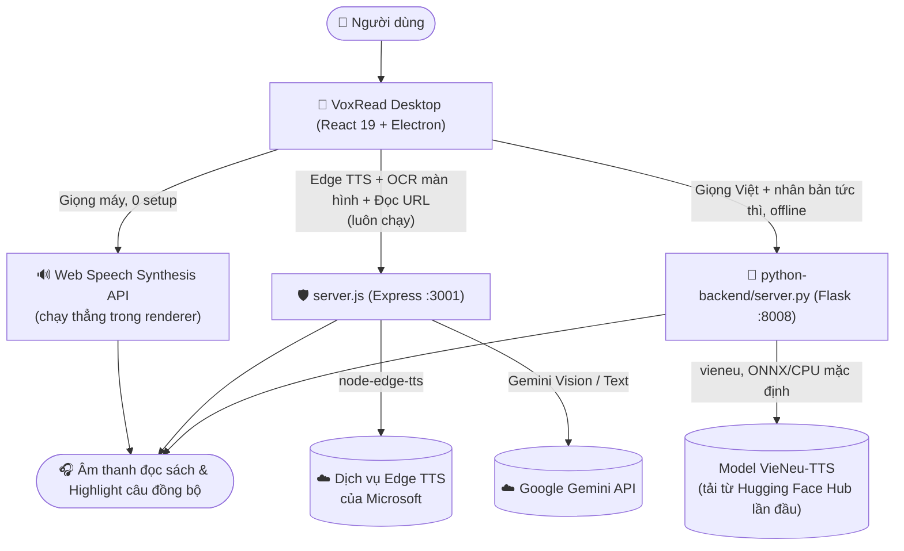

# VoxRead — Trình Đọc Sách Thông Minh với Giọng Đọc AI

[](https://github.com/caoduongle/reader/actions/workflows/ci.yml)

**VoxRead** là ứng dụng đọc sách điện tử (E-Reader) **desktop** hiện đại hỗ trợ định dạng **TXT, EPUB, PDF** với khả năng tổng hợp giọng đọc Text-to-Speech (TTS) mượt mà. Ứng dụng hỗ trợ 3 lựa chọn giọng đọc: **Web Speech API** (giọng máy, 0 cài đặt), **Microsoft Edge TTS** (giọng neural, cần Internet), và **VieNeu-TTS** (giọng Việt chuyên biệt, chạy offline, hỗ trợ **nhân bản giọng tức thì** chỉ từ một đoạn ghi âm ngắn — không cần huấn luyện model).

> [!NOTE]
> Phiên bản Chrome Extension ("AI Đọc Truyện") từng tồn tại ở giai đoạn đầu dự án **đã bị gỡ bỏ hoàn toàn khỏi repository này**. Toàn bộ chức năng của nó đã được gộp vào thẳng ứng dụng VoxRead Desktop (Electron) — bạn **không cần cài thêm bất kỳ tiện ích trình duyệt nào**.

---

## 🏛️ Kiến trúc tổng thể hệ thống

VoxRead là một ứng dụng desktop độc lập (Electron), tự quản lý 2 tiến trình nền cục bộ (loopback-only) khi khởi động: một server Node xử lý Edge TTS + các tính năng AI, và một server Python phục vụ VieNeu-TTS.



Cả 2 server nền (`server.py` cổng 8008 và `server.js` cổng 3001) đều được **Electron main process tự động khởi động cùng lúc app mở lên** (xem `electron/main.ts`) — bạn không cần tự chạy lệnh nào bằng tay khi dùng bản desktop đã cài đặt, miễn là môi trường đã được thiết lập trước theo hướng dẫn bên dưới. Nếu `python-backend` không khởi động được vì lý do gì đó, ứng dụng vẫn dùng được bình thường với Web Speech hoặc Edge TTS.

---

## 📁 Cấu trúc thư mục dự án

| Thư mục / File          | Vai trò & Trách nhiệm                                                                                                    |
| ------------------------ | ------------------------------------------------------------------------------------------------------------------------- |
| `src/`                   | Mã nguồn giao diện người dùng React 19: components, hooks đọc sách/audio, tiện ích lưu trữ.                              |
| `electron/`              | Main process & Preload script: quản lý cửa sổ desktop, tự spawn `python-backend/server.py` và `server.js` khi mở app.    |
| `python-backend/`        | Microservice Python Flask phục vụ **VieNeu-TTS**. Giọng đã nhân bản lưu tại `python-backend/voices/`.                    |
| `server.js` + `server/` + `lib/` | Express proxy cục bộ (cổng 3001): route **Edge TTS** (`/api/speak/edge`), OCR màn hình (`/api/ocr`), đọc URL (`/api/fetch-url`), cùng middleware bảo mật (rate limit, validate, chống SSRF/XSS). |
| `public/`                | Tài nguyên tĩnh (icon, favicon) cho ứng dụng desktop.                                                                     |
| `specs/`                 | Hồ sơ đặc tả kỹ thuật, kế hoạch triển khai (Spec-Kit) theo từng phiên bản tính năng.                                      |
| `docs/`                  | Tài liệu chuyên sâu: `voice-setup.md` (cấu hình 3 giọng đọc), `security.md` (kiến trúc bảo mật).                          |
| `tests/`                 | Bộ test frontend (Vitest + Testing Library): unit, component, security.                                                   |
| `python-backend/tests/`  | Bộ test backend Python (Pytest) cho `server.py`.                                                                         |
| `python-backend/voices/` | Thư mục lưu giọng người dùng đã nhân bản (`user_voices.json` + metadata) — tự tạo nếu chưa có.                            |
| `dist/`                  | Sản phẩm build web production (sinh ra sau `npm run build`, không có sẵn trong repo).                                     |
| `dist-electron/`         | Sản phẩm biên dịch Electron main/preload (`.cjs`, sinh ra sau `npm run build:electron`).                                  |
| `release/`               | Bộ cài đặt Windows desktop (`.exe` NSIS và bản portable, sinh ra sau `npm run electron:build`).                          |

---

## 🚀 Bắt đầu nhanh (Quickstart)

### 📦 Cách 1: Cài đặt đơn giản nhất (Dành cho người dùng)

Dành cho người dùng muốn trải nghiệm đọc sách ngay mà **không cần cài đặt Node.js hay Python**:

1. Tải bộ cài đặt Windows (`VoxRead Setup.exe`) từ mục [**Releases**](https://github.com/caoduongle/reader/releases) hoặc tab [**Actions Artifacts**](https://github.com/caoduongle/reader/actions/workflows/build-electron.yml) (nếu đã có bản build sẵn).
2. Chạy file cài đặt và mở **VoxRead** từ Desktop hoặc Start Menu.
3. Giọng máy ("Web Speech") và Edge TTS dùng được ngay, không cần cấu hình gì thêm (Edge TTS cần Internet). Với VieNeu-TTS (giọng Việt offline + nhân bản giọng), bộ cài đặt cần được đóng gói kèm sẵn `python-backend/venv` — nếu chưa có, làm theo Cách 2 để tự build.

> [!NOTE]
> Từ khi bỏ pipeline RVC/fairseq/PyTorch, bộ cài đặt **nhẹ hơn đáng kể** so với trước đây (từng nặng 500MB–1.5GB do phải đóng gói kèm PyTorch). Dung lượng chính xác sau khi đổi sang VieNeu-TTS (ONNX Runtime, không bắt buộc PyTorch) nên được đo lại sau khi build, chưa có số liệu chính thức tại đây.

---

### 💻 Cách 2: Dành cho nhà phát triển (Build từ mã nguồn)

#### ⚡ Bước 1 — Thiết lập môi trường tự động 1 lệnh

Script tự động kiểm tra Node.js (≥ 18) & Python (≥ 3.10), chạy `npm install`, và tạo virtualenv Python tại `python-backend/venv` + cài `requirements.txt` (chỉ còn `flask` + `vieneu` — không còn cần Visual C++ Build Tools hay GPU bắt buộc như trước):

- **Windows (PowerShell)**:
  ```powershell
  powershell -ExecutionPolicy Bypass -File scripts/setup.ps1
  ```

- **macOS / Linux (Bash)**:
  ```bash
  chmod +x scripts/setup.sh
  ./scripts/setup.sh
  ```

> [!NOTE]
> **GPU không bắt buộc.** VieNeu-TTS mặc định chạy CPU qua ONNX Runtime với tốc độ đủ dùng cho đọc sách theo thời gian thực. Nếu muốn tăng tốc cho văn bản dài, có thể cài thêm tuỳ chọn: `pip install "vieneu[cuda]"` trong venv.

#### 🔑 Bước 2 — Cấu hình biến môi trường (bắt buộc cho tính năng AI, không bắt buộc để đọc sách cơ bản)

Sao chép `.env.example` thành `.env` ở thư mục gốc và điền `GEMINI_API_KEY` (lấy tại [aistudio.google.com/apikey](https://aistudio.google.com/apikey)):

```bash
cp .env.example .env   # Windows: copy .env.example .env
```

`GEMINI_API_KEY` chỉ cần thiết cho tính năng **OCR đọc màn hình** và **đọc nội dung từ URL** (dùng làm phương án cuối khi cả bộ chọn theo trang lẫn Readability đều không trích xuất được). Nếu bỏ qua, app vẫn đọc file TXT/EPUB/PDF và phát giọng (Web Speech / Edge TTS / VieNeu-TTS) bình thường, chỉ 2 tính năng trên sẽ báo lỗi "chưa cấu hình".

> [!NOTE]
> **Đọc URL từ các trang nạp nội dung bằng JavaScript** (ví dụ docln.sbs — nội dung chương chỉ xuất hiện sau khi chạy JS phía client): script setup ở Bước 1 đã tự chạy `npx playwright install chromium` (~150–300MB, tải trình duyệt Chromium headless). Nếu bước đó bị bỏ qua hoặc thất bại do mạng, chỉ tính năng đọc các trang JS-động này bị ảnh hưởng — đọc file và các trang web tĩnh/render sẵn phía server vẫn hoạt động bình thường. Cài lại thủ công bất cứ lúc nào bằng: `npx playwright install chromium`. Lưu ý: bản cài đặt `.exe` đóng gói sẵn (Cách 1) hiện **chưa** đóng gói kèm Chromium này — tính năng chỉ khả dụng khi build từ mã nguồn (Cách 2).

#### 📖 Bước 3 — Khởi động & đóng gói ứng dụng

- **Chạy bản Web (dev)** (mở tại `http://localhost:3000`):
  ```bash
  npm run dev
  ```
- **Chạy bản Desktop Windows (Electron)** — tự spawn cả `server.py` (nếu venv đã có) và `server.js`:
  ```bash
  npm run electron:dev
  ```
- **Đóng gói bộ cài đặt Desktop (.exe)** — chỉ đóng gói kèm venv VieNeu-TTS nếu `python-backend/venv` đã tồn tại lúc build:
  ```bash
  npm run electron:build
  ```

---

### 🧪 Chạy Kiểm Thử Tự Động (Testing)

1. **Frontend Tests (Vitest & React Testing Library)**:
   ```bash
   npm test          # chạy một lần
   npm run test:watch  # chế độ theo dõi
   ```

2. **Backend Tests (Pytest)** — cần cài thêm `requirements-dev.txt` (chứa `pytest`, không nằm trong `requirements.txt` mặc định) trước khi chạy:
   - **Windows**:
     ```powershell
     python-backend\venv\Scripts\pip.exe install -r python-backend\requirements-dev.txt
     python-backend\venv\Scripts\python.exe -m pytest python-backend\tests
     ```
   - **macOS / Linux**:
     ```bash
     python-backend/venv/bin/pip install -r python-backend/requirements-dev.txt
     python-backend/venv/bin/pytest python-backend/tests
     ```

---

### 🚀 Tự Động Hóa CI/CD (GitHub Actions)

Dự án thiết lập 3 workflow trong `.github/workflows/`:

1. **`ci.yml`** — chạy khi `push`/`pull_request` vào `main`: job `frontend` (`typecheck` → `lint` → `test` → `build` trên `ubuntu-latest`) và job `backend` (Python 3.10 + `pytest`).
2. **`build-electron.yml`** — chạy thủ công (`workflow_dispatch`) hoặc khi đẩy tag phiên bản (vd. `v1.0.0`): đóng gói `.exe` trên `windows-latest` bằng `electron-builder`.
3. **`security-audit.yml`** — chạy khi push/PR vào `main`/`master` và định kỳ hằng tuần (thứ Hai 04:00 UTC): `npm audit --audit-level=high` + bộ test bảo mật Vitest.

---

### 🎙️ Cấu hình 3 giọng đọc

VoxRead hỗ trợ 3 engine giọng đọc ngang hàng, chọn trong **Cài đặt** (`Alt+,`) → tab **"Giọng đọc & Tốc độ"**:

| Engine | Cần Internet | Cần cài thêm gì | Nhân bản giọng riêng |
|---|---|---|---|
| **Giọng máy** (Web Speech API) | Tuỳ hệ điều hành | Không | Không |
| **Edge TTS** (Microsoft) | Có | Không | Không |
| **VieNeu-TTS** | Chỉ lần đầu (tải model) | `python-backend/venv` | **Có — không cần train** |

**Nhân bản giọng của bạn với VieNeu-TTS** (thay thế hoàn toàn quy trình huấn luyện RVC qua Google Colab trước đây):

1. Chọn engine **"VieNeu-TTS"** trong Cài đặt.
2. Ở mục **"Nhân bản giọng của tôi"**: đặt tên cho giọng, chọn một file audio mẫu **3–8 giây** (`.wav`/`.mp3`/`.m4a`).
3. Bấm **"Nhân bản giọng"** — giọng mới xuất hiện ngay trong danh sách, không cần huấn luyện, không cần khởi động lại ứng dụng.
4. Giọng đã nhân bản được lưu tại `python-backend/voices/` (bấm **"Mở thư mục"** trong Cài đặt để xem trực tiếp).

> 📖 Xem thêm chi tiết vận hành 3 engine tại [docs/voice-setup.md](docs/voice-setup.md).

---

## 🔍 Ghi chú kiến trúc backend

Hai dịch vụ backend chạy cục bộ (loopback), được Electron tự khởi động cùng app:

1. **`python-backend/server.py` (cổng 8008)** — Flask, phục vụ **VieNeu-TTS**: tổng hợp giọng đọc tiếng Việt (`POST /speak`) và nhân bản giọng tức thì (`POST /voices/add`). Yêu cầu venv Python tại `python-backend/venv` (tạo bằng `scripts/setup.ps1`/`setup.sh`); nếu thiếu, app vẫn chạy bình thường với "Giọng máy" hoặc "Edge TTS".
2. **`server.js` (cổng 3001)** — Express:
   - `/api/speak/edge`: tổng hợp giọng Microsoft Edge TTS trực tiếp (`node-edge-tts`), không qua Python.
   - `/api/ocr`: nhận diện chữ từ ảnh chụp màn hình bằng Gemini Vision, kèm xác thực magic bytes.
   - `/api/fetch-url`: trích xuất nội dung văn bản từ URL, chống SSRF (`lib/ssrfGuard.js`) và làm sạch XSS (`server/lib/sanitizer.js`). Thứ tự trích xuất: các bước dọn DOM riêng theo từng trang chạy trước tiên qua `adapter.preprocessDocument` (`server/lib/siteAdapters.js`) — ví dụ `unprotectHakoContent` tự giải mã khối `#chapter-c-protected` (base64 / `base64_reverse` / `xor_shuffle`, khoá theo `data-s`/`data-k`/`data-c`) mà docln.sbs/docln.net/ln.hako.vn giấu nội dung chương vào, ngay trên HTML tĩnh, không cần chạy JS của trang → rồi mới đến bộ chọn CSS riêng theo từng trang (ví dụ Zuminovel) → `@mozilla/readability` → nếu nội dung tĩnh vẫn quá ít (trang nạp nội dung bằng JavaScript theo cách khác, hoặc adapter chưa hỗ trợ), tự động hiển thị lại trang bằng trình duyệt ảo Chromium headless (`lib/renderPage.js`, dùng Playwright, có SSRF guard riêng cho từng request con) → cuối cùng mới đến Gemini AI. Liên kết "chương sau" được dò bằng `server/lib/nextChapter.js` (nhiều chiến lược: `rel="next"`, bộ chọn theo trang, từ khoá, tên class/id).

---

## 📌 Ghi chú lịch sử dự án

Dự án khởi đầu dưới dạng một Chrome Extension ("AI Đọc Truyện") gọi tới một server giọng nói local. Sau đó có giai đoạn phát triển thành một backend SaaS đa người dùng đầy đủ (Supabase, PostgreSQL Row-Level Security, xác thực JWT), trước khi được gỡ bỏ để quay về **kiến trúc local, single-user** — kiến trúc VoxRead vẫn giữ tới hiện tại.

**Cập nhật gần nhất (feature `048-desktop-tts-migration`)**: tiếp nối đúng tinh thần "local, single-user" đó, dự án đã loại bỏ hoàn toàn pipeline **RVC** (huấn luyện qua Google Colab, `fairseq`, PyTorch bắt buộc) — nguồn gốc của phần lớn độ phức tạp vận hành trong lịch sử gần đây — để chuyển sang **VieNeu-TTS** (nhân bản giọng tức thì, không cần train) cho giọng Việt cục bộ, và tách **Microsoft Edge TTS** thành một engine độc lập xử lý trực tiếp trong `server.js` thay vì làm bước trung gian cho RVC như trước. Dự án cũng dừng nhắm tới việc lưu trữ song song như một website công khai (`voxread.app`), chỉ còn tập trung vào trải nghiệm **desktop app đọc TXT/EPUB/PDF**. Xem toàn bộ hồ sơ đặc tả tại [`specs/048-desktop-tts-migration/`](specs/048-desktop-tts-migration/).
