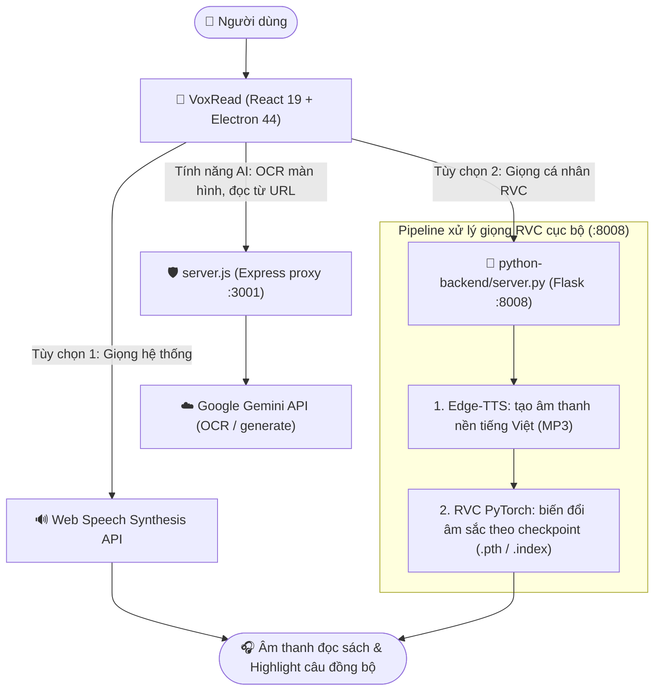

# VoxRead — Trình Đọc Sách Thông Minh với Giọng Đọc AI & RVC Local

[](https://github.com/caoduongle/reader/actions/workflows/ci.yml)

**VoxRead** là ứng dụng đọc sách điện tử (E-Reader) hiện đại hỗ trợ định dạng **TXT, EPUB, PDF** với khả năng tổng hợp giọng đọc Text-to-Speech (TTS) mượt mà. Ứng dụng kết hợp giữa giọng đọc Web Speech tự nhiên của hệ thống và công nghệ **nhân bản giọng nói AI (RVC — Retrieval-based Voice Conversion)** chạy cục bộ (offline) trên máy tính của bạn.

> [!NOTE]
> Phiên bản Chrome Extension ("AI Đọc Truyện") từng tồn tại ở giai đoạn đầu dự án **đã bị gỡ bỏ hoàn toàn khỏi repository này**. Toàn bộ chức năng của nó đã được gộp vào thẳng ứng dụng VoxRead (Web + Desktop Electron) — bạn **không cần cài thêm bất kỳ tiện ích trình duyệt nào**.

---

## 🏛️ Kiến trúc tổng thể hệ thống

VoxRead là một ứng dụng độc lập duy nhất (Web hoặc Desktop Electron), tự quản lý 2 tiến trình nền cục bộ (loopback-only) khi khởi động: server giọng đọc RVC và một proxy bảo vệ API key gọi tới Gemini.



Cả 2 server nền (`server.py` cổng 8008 và `server.js` cổng 3001) đều được **Electron main process tự động khởi động cùng lúc app mở lên** (xem `electron/main.ts`) — bạn không cần tự chạy lệnh nào bằng tay khi dùng bản desktop đã cài đặt, miễn là môi trường đã được thiết lập trước theo hướng dẫn bên dưới.

---

## 📁 Cấu trúc thư mục dự án

| Thư mục / File          | Vai trò & Trách nhiệm                                                                                                    |
| ------------------------ | ------------------------------------------------------------------------------------------------------------------------- |
| `src/`                   | Mã nguồn giao diện người dùng React 19: components, hooks đọc sách/audio, tiện ích lưu trữ.                              |
| `electron/`              | Main process & Preload script: quản lý cửa sổ desktop, tự spawn `python-backend/server.py` và `server.js` khi mở app.    |
| `python-backend/`        | Microservice Python Flask (Edge-TTS + RVC) để nhân bản giọng đọc. Model `.pth`/`.index` đặt tại `python-backend/model/`. |
| `server.js` + `server/` + `lib/` | Express proxy cục bộ (cổng 3001) bảo vệ `GEMINI_API_KEY`, cùng middleware bảo mật (rate limit, validate, chống SSRF/XSS). |
| `public/`                | Tài nguyên tĩnh (icon, logo, mẫu truyện) cho bản web và desktop.                                                          |
| `specs/`                 | Hồ sơ đặc tả kỹ thuật, kế hoạch triển khai (Spec-Kit) theo từng phiên bản tính năng.                                      |
| `docs/`                  | Tài liệu chuyên sâu: `rvc-voice-setup.md` (huấn luyện & cài giọng RVC chi tiết), `security.md` (kiến trúc bảo mật).       |
| `tests/`                 | Bộ test frontend (Vitest + Testing Library): unit, component, security, SEO.                                             |
| `python-backend/tests/`  | Bộ test backend Python (Pytest) cho `server.py`.                                                                         |
| `python-backend/model/`  | Thư mục **quy ước** chứa trọng số mô hình RVC đã huấn luyện (`.pth` và `.index`) — tự tạo nếu chưa có.                    |
| `python-backend/wheels/` | Wheel `fairseq` build sẵn cho Windows, tránh cần Visual C++ Build Tools khi cài lại.                                     |
| `dist/`                  | Sản phẩm build web production (sinh ra sau `npm run build`, không có sẵn trong repo).                                     |
| `dist-electron/`         | Sản phẩm biên dịch Electron main/preload (`.cjs`, sinh ra sau `npm run build:electron`).                                  |
| `release/`               | Bộ cài đặt Windows desktop (`.exe` NSIS và bản portable, sinh ra sau `npm run electron:build`).                          |

---

## 🚀 Bắt đầu nhanh (Quickstart)

### 📦 Cách 1: Cài đặt đơn giản nhất (Dành cho người dùng)

Dành cho người dùng muốn trải nghiệm đọc sách ngay mà **không cần cài đặt Node.js, Python hay Visual C++ Build Tools**:

1. Tải bộ cài đặt Windows (`VoxRead Setup.exe`) từ mục [**Releases**](https://github.com/caoduongle/reader/releases) hoặc tab [**Actions Artifacts**](https://github.com/caoduongle/reader/actions/workflows/build-electron.yml) (nếu đã có bản build sẵn).
2. Chạy file cài đặt và mở **VoxRead** từ Desktop hoặc Start Menu.
3. Với giọng đọc hệ thống ("Giọng máy"), ứng dụng dùng được ngay. Với giọng RVC cá nhân hóa, bộ cài đặt cần được đóng gói kèm sẵn `python-backend/venv` (xem mục "Đóng gói" bên dưới) — nếu chưa có, làm theo Cách 2 để tự build.

> [!NOTE]
> **Dung lượng bộ cài đặt tương đối nặng (khoảng 500MB – 1.5GB)** khi đã đóng gói kèm venv Python + PyTorch, vì bao gồm trọn gói động cơ suy luận offline để không phụ thuộc môi trường máy người dùng.

---

### 💻 Cách 2: Dành cho nhà phát triển (Build từ mã nguồn)

#### ⚡ Bước 1 — Thiết lập môi trường tự động 1 lệnh

Script tự động kiểm tra Node.js (≥ 18) & Python (≥ 3.10), chạy `npm install`, và tạo virtualenv Python tại `python-backend/venv` + cài `requirements.txt`:

- **Windows (PowerShell)**:
  ```powershell
  powershell -ExecutionPolicy Bypass -File scripts/setup.ps1
  ```
  > [!NOTE]
  > **Không cần Visual C++ Build Tools trên Windows**: `fairseq` được cài từ wheel dựng sẵn trong `python-backend/wheels/`. Nếu đổi phiên bản Python, cần build lại wheel theo [`python-backend/wheels/README.md`](python-backend/wheels/README.md).

- **macOS / Linux (Bash)**:
  ```bash
  chmod +x scripts/setup.sh
  ./scripts/setup.sh
  ```

#### 🔑 Bước 2 — Cấu hình biến môi trường (bắt buộc cho tính năng AI, không bắt buộc để đọc sách cơ bản)

Sao chép `.env.example` thành `.env` ở thư mục gốc và điền `GEMINI_API_KEY` (lấy tại [aistudio.google.com/apikey](https://aistudio.google.com/apikey)):

```bash
cp .env.example .env   # Windows: copy .env.example .env
```

`GEMINI_API_KEY` chỉ cần thiết cho tính năng **OCR đọc màn hình** và **đọc nội dung từ URL**. Nếu bỏ qua, app vẫn đọc file TXT/EPUB/PDF và phát giọng bình thường, chỉ 2 tính năng trên sẽ báo lỗi "chưa cấu hình".

#### 📖 Bước 3 — Khởi động & đóng gói ứng dụng

- **Chạy bản Web** (mở tại `http://localhost:3000`):
  ```bash
  npm run dev
  ```
- **Chạy bản Desktop Windows (Electron)** — tự spawn cả `server.py` (nếu venv đã có) và `server.js`:
  ```bash
  npm run electron:dev
  ```
- **Đóng gói bộ cài đặt Desktop (.exe)** — chỉ đóng gói kèm venv RVC nếu `python-backend/venv` đã tồn tại lúc build:
  ```bash
  npm run electron:build
  ```

---

### 🧪 Chạy Kiểm Thử Tự Động (Testing)

1. **Frontend Tests (Vitest & React Testing Library)**:
   ```bash
   npm test          # chạy một lần
   npm run test:watch  # chế độ theo dõi
   ```

2. **Backend Tests (Pytest)** — cần cài thêm `requirements-dev.txt` (chứa `pytest`, không nằm trong `requirements.txt` mặc định) trước khi chạy:
   - **Windows**:
     ```powershell
     python-backend\venv\Scripts\pip.exe install -r python-backend\requirements-dev.txt
     python-backend\venv\Scripts\python.exe -m pytest python-backend\tests
     ```
   - **macOS / Linux**:
     ```bash
     python-backend/venv/bin/pip install -r python-backend/requirements-dev.txt
     python-backend/venv/bin/pytest python-backend/tests
     ```

---

### 🚀 Tự Động Hóa CI/CD (GitHub Actions)

Dự án thiết lập 3 workflow trong `.github/workflows/`:

1. **`ci.yml`** — chạy khi `push`/`pull_request` vào `main`: job `frontend` (`typecheck` → `lint` → `test` → `build` trên `ubuntu-latest`) và job `backend` (Python 3.10 + `pytest`).
2. **`build-electron.yml`** — chạy thủ công (`workflow_dispatch`) hoặc khi đẩy tag phiên bản (vd. `v1.0.0`): đóng gói `.exe` trên `windows-latest` bằng `electron-builder`.
3. **`security-audit.yml`** — chạy khi push/PR vào `main`/`master` và định kỳ hằng tuần (thứ Hai 04:00 UTC): `npm audit --audit-level=high` + bộ test bảo mật Vitest.

---

### 🎙️ Cấu hình giọng đọc cá nhân RVC (Tùy chọn)

Dành cho người muốn đọc sách bằng chính giọng AI của bản thân:

1. **Đặt file model vào thư mục model/**:
   - Chỉ cần copy file `.pth` và `.index` bất kỳ (lấy từ Colab, xem hướng dẫn chi tiết bên dưới) vào thư mục `python-backend/model/`. Hệ thống sẽ **tự động nhận diện** model mà không cần sửa bất kỳ dòng code nào.
   - Nếu máy **không có GPU NVIDIA**, bạn có thể đổi dòng `DEVICE = "cuda:0"` thành `DEVICE = "cpu:0"` trong `python-backend/server.py` nếu muốn ép chạy CPU (hoặc thư viện sẽ tự động fallback sang CPU).

2. **Khởi chạy server RVC** (nếu chạy độc lập ngoài Electron để test):
   - **Windows**: `python-backend\venv\Scripts\activate` rồi `python python-backend\server.py`
   - **macOS/Linux**: `source python-backend/venv/bin/activate` rồi `python python-backend/server.py`
   - Server lắng nghe tại `http://localhost:8008`. Mở VoxRead → **Cài đặt** → chọn nguồn giọng **"Giọng của tôi (RVC local)"**.
   - Khi chạy qua `npm run electron:dev` hoặc bản desktop đã cài đặt, bước này **được tự động hóa** — không cần tự gõ lệnh.

> 📖 **Hướng dẫn chi tiết toàn tập về RVC**:
> Xem toàn bộ hướng dẫn chuẩn bị dataset, khử ồn audio, huấn luyện model miễn phí trên Google Colab, và cách cài PyTorch bản CUDA phù hợp GPU tại:
> 👉 **[docs/rvc-voice-setup.md](docs/rvc-voice-setup.md)**

---

## 🔍 Ghi chú kiến trúc backend

Hai dịch vụ backend chạy cục bộ (loopback), được Electron tự khởi động cùng app:

1. **`python-backend/server.py` (cổng 8008)** — Flask, pipeline **Edge-TTS** + **RVC** (`rvc-python`) để tổng hợp và chuyển đổi âm sắc giọng đọc tiếng Việt. Yêu cầu venv Python tại `python-backend/venv` (tạo bằng `scripts/setup.ps1`/`setup.sh`) và model `.pth`/`.index` hợp lệ; nếu thiếu, app vẫn chạy bình thường với "Giọng máy".
2. **`server.js` (cổng 3001)** — Express, gateway bảo vệ `GEMINI_API_KEY`:
   - `/api/generate`: proxy gọi Gemini API.
   - `/api/ocr`: nhận diện chữ từ ảnh chụp màn hình bằng Gemini Vision, kèm xác thực magic bytes.
   - `/api/fetch-url`: trích xuất nội dung văn bản từ URL, chống SSRF (`lib/ssrfGuard.js`) và làm sạch XSS (`server/lib/sanitizer.js`).

---

## 📌 Ghi chú lịch sử dự án

Dự án khởi đầu dưới dạng một Chrome Extension ("AI Đọc Truyện") gọi tới server RVC local. Từ các phiên bản sau, toàn bộ chức năng đã được viết lại thành ứng dụng độc lập VoxRead (Web + Electron Desktop) với khả năng import TXT/PDF/EPUB và quản lý tiến trình đọc sách đầy đủ hơn nhiều so với extension gốc. **Thư mục extension cũ đã được xóa khỏi repository** — mọi tính năng hiện chỉ còn tồn tại và được phát triển tiếp trong ứng dụng VoxRead.
