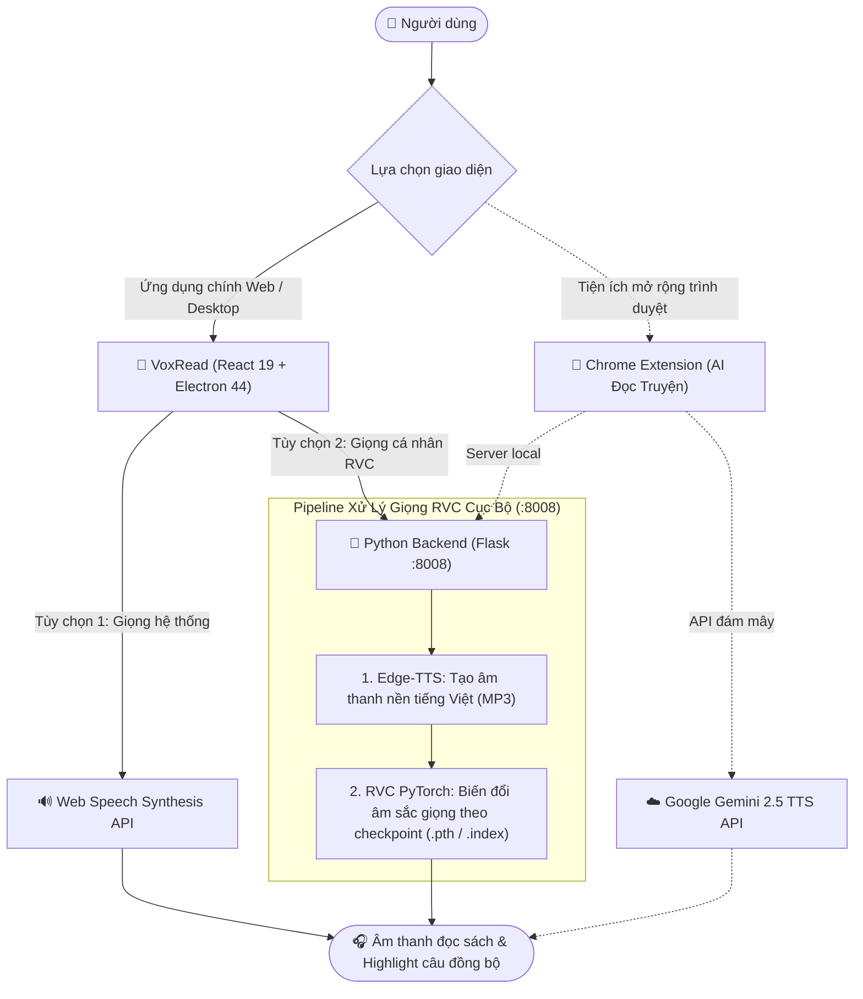

# VoxRead — Trình Đọc Sách Thông Minh với Giọng Đọc AI & RVC Local

[](https://github.com/caoduongle/reader/actions/workflows/ci.yml)

**VoxRead** là ứng dụng đọc sách điện tử (E-Reader) hiện đại hỗ trợ định dạng **TXT, EPUB, PDF** với khả năng tổng hợp giọng đọc Text-to-Speech (TTS) mượt mà. Ứng dụng kết hợp giữa giọng đọc Web Speech tự nhiên của hệ thống và công nghệ **nhân bản giọng nói AI (RVC — Retrieval-based Voice Conversion)** chạy cục bộ (offline) trên máy tính của bạn.

---

## 🏛️ Kiến trúc tổng thể hệ thống

Hệ thống hỗ trợ cả giao diện ứng dụng chính (Web & Windows Desktop) và tiện ích trình duyệt (Legacy Extension), kết nối linh hoạt tới các bộ tổng hợp giọng đọc:



---

## 📁 Cấu trúc thư mục dự án

| Thư mục           | Vai trò & Trách nhiệm (1 dòng)                                                                                  |
| ----------------- | --------------------------------------------------------------------------------------------------------------- |
| `src/`            | Toàn bộ mã nguồn giao diện người dùng React 19, các components, hooks đọc sách, audio và tiện ích lưu trữ.      |
| `electron/`       | Mã nguồn tiến trình chính (Main process) và Preload script quản lý cửa sổ desktop và tiến trình Python backend. |
| `python-backend/` | Microservice Python Flask chạy Edge-TTS và RVC local để nhân bản giọng đọc và suy luận âm thanh.                |
| `public/`         | Tài nguyên tĩnh công khai (icon, logo, mẫu truyện) phục vụ ứng dụng web và desktop.                             |
| `specs/`          | Hồ sơ đặc tả kỹ thuật, kế hoạch triển khai (Spec-Kit) và checklist chất lượng kiểm thử của từng phiên bản.      |
| `docs/`           | Tài liệu hướng dẫn chuyên sâu chi tiết (hướng dẫn huấn luyện giọng RVC, quy chuẩn kiến trúc).                   |
| `model/`          | Thư mục quy ước chứa trọng số mô hình RVC đã huấn luyện (`.pth` và `.index`).                                   |
| `dist/`           | Sản phẩm đóng gói web production sau khi tối ưu hóa dung lượng (bundle code-splitting).                         |
| `dist-electron/`  | Sản phẩm biên dịch tiến trình Electron main và preload (`.cjs`).                                                |
| `release/`        | Bộ cài đặt ứng dụng Windows desktop (`.exe` NSIS và bản portable).                                              |

---

## 🚀 Bắt đầu nhanh (Quickstart)

### 📦 Cách 1: Cài đặt đơn giản nhất (Dành cho người dùng)

Dành cho người dùng muốn trải nghiệm đọc sách ngay mà **không cần cài đặt Node.js, Python hay Visual C++ Build Tools**:

1. Tải bộ cài đặt Windows (`VoxRead Setup.exe`) từ mục [**Releases**](https://github.com/caoduongle/reader/releases) hoặc tab [**Actions Artifacts**](https://github.com/caoduongle/reader/actions/workflows/build-electron.yml).
2. Chạy file cài đặt và mở **VoxRead** từ Desktop hoặc Start Menu.
3. Ứng dụng đã được tích hợp sẵn toàn bộ môi trường suy luận giọng đọc AI (Python runtime, PyTorch CPU, Edge-TTS và RVC), tự động khởi động server nền và sẵn sàng đọc sách ngay lập tức.

> [!NOTE]
> **Dung lượng bộ cài đặt tương đối nặng (khoảng 500MB – 1.5GB)**:  
> Bản cài đặt desktop bao gồm trọn gói động cơ mạng nơ-ron học sâu PyTorch và các thư viện xử lý âm thanh offline độc lập, giúp ứng dụng hoạt động 100% không phụ thuộc vào môi trường máy tính người dùng.

---

### 💻 Cách 2: Dành cho nhà phát triển (Build từ mã nguồn)

Dành cho lập trình viên muốn phát triển thêm tính năng hoặc tùy biến mã nguồn:

#### ⚡ Thiết lập môi trường tự động 1 lệnh

Dự án cung cấp sẵn script tự động kiểm tra phiên bản Node.js & Python, cài đặt dependencies JavaScript (`npm install`), và cấu hình môi trường ảo Python virtualenv cho backend:

- **Trên Windows (PowerShell)**:

  ```powershell
  powershell -ExecutionPolicy Bypass -File scripts/setup.ps1
  ```

  _(Hoặc chạy `.\scripts\setup.ps1` nếu bạn đã mở sẵn terminal PowerShell)_.

  > [!NOTE]
  > **Không cần Visual C++ Build Tools trên Windows**: `fairseq` được đóng gói sẵn dạng wheel trong `python-backend/wheels/` để tránh yêu cầu Visual C++ Build Tools khi cài lại — nếu đổi phiên bản Python, cần build lại wheel theo hướng dẫn trong [`python-backend/wheels/README.md`](python-backend/wheels/README.md).

- **Trên macOS / Linux (Bash)**:
  ```bash
  chmod +x scripts/setup.sh
  ./scripts/setup.sh
  ```

#### 📖 Khởi động & đóng gói ứng dụng

Sau khi chạy script thiết lập xong, bạn có thể chạy:

- **Chạy bản Web** (mở tại `http://localhost:3000`):
  ```bash
  npm run dev
  ```
- **Chạy bản Desktop Windows (Electron)**:
  ```bash
  npm run electron:dev
  ```
- **Đóng gói bộ cài đặt Desktop (.exe)**:
  ```bash
  npm run electron:build
  ```

---

### 🧪 Chạy Kiểm Thử Tự Động (Testing)

Dự án trang bị hệ thống kiểm thử tự động hai đầu:

1. **Frontend Tests (Vitest & React Testing Library)**:
   ```bash
   # Chạy toàn bộ unit & component tests một lần
   npm test

   # Chạy ở chế độ theo dõi (watch mode)
   npm run test:watch
   ```

2. **Backend Tests (Pytest)**:
   - **Windows**:
     ```powershell
     python-backend\venv\Scripts\python.exe -m pytest python-backend\tests
     ```
   - **macOS / Linux**:
     ```bash
     python-backend/venv/bin/pytest python-backend/tests
     ```

---

### 🚀 Tự Động Hóa CI/CD (GitHub Actions)

Dự án thiết lập 2 luồng workflow chuyên biệt:

1. **Continuous Integration ([`.github/workflows/ci.yml`](.github/workflows/ci.yml))**:
   - **Kích hoạt**: Tự động chạy khi có `push` hoặc `pull_request` vào nhánh `main`.
   - **Cơ chế**: Chạy song song 2 job trên `ubuntu-latest`:
     - **`frontend`**: Cài đặt bằng `npm ci`, tuần tự kiểm tra `typecheck` $\rightarrow$ `lint` $\rightarrow$ `test` $\rightarrow$ `build` (dừng ngay lập tức nếu bước nào thất bại).
     - **`backend`**: Cài đặt dependencies Python 3.10 và chạy `pytest`.
2. **Đóng gói Desktop Installer ([`.github/workflows/build-electron.yml`](.github/workflows/build-electron.yml))**:
   - **Kích hoạt**: Chạy thủ công trên giao diện GitHub (`workflow_dispatch`) hoặc tự động kích hoạt khi đẩy git tag phiên bản release (ví dụ: `v1.0.0`).
   - **Cơ chế**: Chạy trên `windows-latest` để đóng gói tệp cài đặt `.exe` bằng `electron-builder` và tải artifact lên GitHub.

---

### 🎙️ Cấu hình giọng đọc cá nhân RVC (Tùy chọn)

Dành cho người muốn đọc sách bằng chính giọng AI của bản thân:

1. **Đặt file model**:
   - Copy 2 file `.pth` và `.index` vào thư mục `python-backend/model/`.
2. **Khởi chạy server RVC**:
   - Chạy lệnh:
     ```bash
     cd python-backend
     venv\Scripts\activate
     python server.py
     ```
   - Server lắng nghe tại `http://localhost:8008`. Mở VoxRead $\rightarrow$ vào **Cài đặt** $\rightarrow$ chọn nguồn giọng **"Giọng của tôi (Local RVC)"** để bắt đầu nghe.

> 📖 **Hướng dẫn chi tiết toàn tập về RVC**:  
> Xem toàn bộ hướng dẫn chuẩn bị dataset, khử ồn audio, và các bước huấn luyện model miễn phí trên Google Colab tại:  
> 👉 **[Tài liệu hướng dẫn huấn luyện & cài đặt RVC chi tiết (docs/rvc-voice-setup.md)](docs/rvc-voice-setup.md)**.

---

## 🔍 Ghi chú kiến trúc backend

Hệ thống sử dụng hai dịch vụ backend chạy cục bộ (loopback) phục vụ các mục đích chuyên biệt:

1. **`python-backend/server.py` (Cổng 8008)**:
   - Viết bằng **Flask**, sử dụng pipeline kết hợp **Edge-TTS** và **RVC** (`rvc-python`) để tổng hợp giọng đọc tiếng Việt và chuyển đổi âm sắc theo mô hình cá nhân hóa.
   - Tự động đóng gói venv và khởi động cùng ứng dụng desktop Electron.

2. **`server.js` (Cổng 3001)**:
   - Viết bằng **Express**, đóng vai trò gateway cục bộ trung gian cho các tính năng:
     - `/api/generate`: Proxy an toàn gọi Gemini API (bảo vệ API key).
     - `/api/ocr`: Nhận diện chữ từ ảnh chụp màn hình bằng mô hình Gemini Vision kèm xác thực magic bytes.
     - `/api/fetch-url`: Trích xuất nội dung văn bản từ đường dẫn web kèm cơ chế chống SSRF và làm sạch XSS.

---

## 📌 Hạng mục định hướng phát triển

- **Tiện ích Chrome Extension (`tts-extension`)**: Hiện tại VoxRead đã phát triển thành ứng dụng độc lập hoàn chỉnh trên Web và Desktop (Electron) với khả năng import tệp TXT/PDF/EPUB và quản lý tiến trình đọc sách. Tiện ích mở rộng Chrome extension cũ có thể được tách thành repository riêng biệt hoặc tích hợp sâu vào hệ sinh thái VoxRead.

