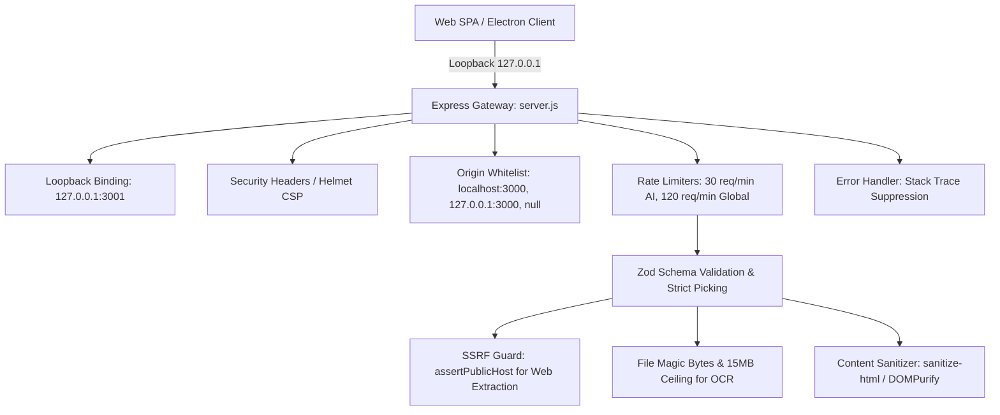

# VoxRead Application Security Architecture & Hardening Guide

This document specifies the security controls and operational practices implemented in the VoxRead local application, backend proxy (`server.js`), and Python speech synthesis server (`python-backend/server.py`).

---

## 1. Security Architecture Overview

VoxRead operates as a local, privacy-focused desktop and web application. All data resides locally on the user's device, with lightweight local proxies for AI processing and speech synthesis.

The system implements defense-in-depth across multiple protective tiers:

---

## 2. Core Security Defenses

### 1. Loopback Binding & Network Isolation
- **Strict Host Binding**: The Express proxy (`server.js`) binds strictly to `127.0.0.1:3001`. The Python speech server binds strictly to `127.0.0.1:8008`.
- **No External Exposure**: Neither server listens on `0.0.0.0`, preventing remote devices on the same local network (LAN) from accessing the application services.

### 2. Strict CORS Origin Whitelisting
- **Allowed Origins**: Requests are strictly validated against an approved origin set:
  - `http://localhost:3000` (Local development)
  - `http://127.0.0.1:3000` (Local production web preview)
  - `null` (Chromium / Electron packaged builds loading from `file://`)
- **Python Backend CORS**: Preflight `OPTIONS /speak` requests echo CORS headers only for whitelisted origins and reject arbitrary origins without wildcard `*` leakage.

### 3. HTTP Security Headers & Helmet CSP
- `server.js` configures `helmet` with:
  - **Content-Security-Policy (CSP)**: `default-src 'self'`, restricting resource loading.
  - **Frame Protection**: `frameAncestors: ["'none'"]` and `frameguard: { action: 'deny' }` to prevent clickjacking.
  - **MIME Sniffing**: `noSniff: true` (`X-Content-Type-Options: nosniff`).
  - **HSTS**: `max-age=31536000; includeSubDomains; preload`.
  - **Permissions-Policy**: Disables unnecessary hardware APIs (`camera=()`, `microphone=()`, `geolocation=()`).
  - **Fingerprint Suppression**: `x-powered-by` header disabled.

### 4. Server-Side Request Forgery (SSRF) Guard
- In `/api/fetch-url`, user-provided URLs are parsed and inspected by `lib/ssrfGuard.js` (`assertPublicHost`).
- Resolves DNS addresses and blocks private, loopback, link-local, and cloud metadata IP ranges (`10.0.0.0/8`, `172.16.0.0/12`, `192.168.0.0/16`, `127.0.0.0/8`, `169.254.0.0/16`).
- **Headless-render fallback (`lib/renderPage.js`)**: pages whose main content is hydrated client-side (e.g. `docln.sbs`) are re-fetched through a sandboxed headless Chromium instance so their JavaScript can run. The *same* `assertPublicHost` guard re-validates the initial navigation **and every subsequent sub-request the rendered page issues** (scripts, XHR/fetch, redirects) via Playwright's request routing, so page JavaScript cannot pivot into internal/private network resources. Image/media/font requests are dropped outright (perf + reduced SSRF surface); validated hostnames are memoized per render call. As with the plain-fetch path, full DNS-rebinding immunity would require socket-level IP pinning and is out of scope — see the equivalent note in `lib/ssrfGuard.js`.

### 5. Multi-Tier Rate Limiting
- `server/middleware/rateLimiter.js` enforces request caps:
  - **AI Endpoints (`aiRateLimiter`)**: 30 requests/minute per IP for `/api/generate` and `/api/ocr` to prevent accidental loops or API quota exhaustion.
  - **Web Extraction (`fetchUrlRateLimiter`)**: 15 requests/minute per IP for `/api/fetch-url`, tighter than the general AI tier because the headless-render fallback is meaningfully more expensive (CPU/memory) than a plain fetch.
  - **Global Endpoints (`globalRateLimiter`)**: 120 requests/minute across general endpoints.

### 6. Input Validation & Strict Typing
- All incoming payloads are validated via Zod schemas before hitting business logic (`server/validators/apiSchemas.js`):
  - `generateSchema`: Validates prompt length (1–50,000 chars), optional model, and system instructions.
  - `fetchUrlSchema`: Validates HTTP/HTTPS protocol and 2048-char maximum URL length.
  - `ocrSchema`: Validates image data presence and format.

### 7. File Upload & Magic Bytes Verification
- In `/api/ocr`, image data is verified via `server/middleware/uploadGuard.js`:
  - **Magic Bytes Inspection**: Inspects true binary header signatures (using `file-type`) to ensure the file is an authorized image/document type (JPEG, PNG, WEBP, PDF), preventing malicious executable disguise.
  - **Payload Size Limits**: Strict 15MB cap on base64 image data.

### 8. HTML Sanitization & XSS Defense
- **Server Sanitization**: Extracted web content in `/api/fetch-url` is sanitized using `sanitize-html` (`server/lib/sanitizer.js`), removing dangerous tags (`<script>`, `<iframe>`, `<object>`) and active event handlers (`onload`, `onerror`).
- **Client Sanitization**: Client-side rendering utilizes `DOMPurify` before injecting formatted chapter HTML into the reader view.

### 9. Production Error Trimming & Information Leakage Prevention
- Global error handler (`server/middleware/errorHandler.js`) catches all unhandled exceptions:
  - In production (`NODE_ENV=production`), returns sanitized generic error messages and suppresses stack traces, file paths, and internal server details.
  - Security audit logs record structured error events locally for debugging.

---

## 3. Secret Management

- **API Keys**: External API keys (`GEMINI_API_KEY`) reside exclusively in local `.env` files or application settings and are never bundled into client distributions.
- **Git Hygiene**: `.gitignore` strictly guards `.env`, `.env.*`, and temporary build outputs.

---

## 4. Production Build & Bundling Hardening

1. **Vite Production Bundler**:
   - `build.sourcemap: false`: Disallows leaking readable TypeScript sources in production assets.
   - `esbuild.drop: ['console', 'debugger']`: Automatically strips debug and console outputs from production bundles.
2. **Electron Security Isolation**:
   - Context isolation enabled in Electron main and preload processes.
   - Node integration disabled in renderer frames.
