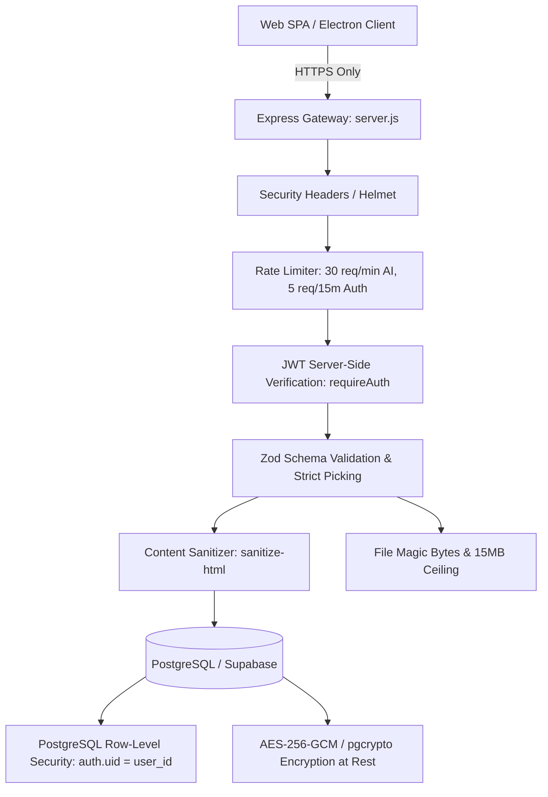

# VoxRead Application Security Architecture & Hardening Guide

This document specifies the security controls and operational practices implemented in the VoxRead backend, database layer, and data communication flow.

---

## 1. Security Architecture Overview

The system implements defense-in-depth across multiple protective tiers:

---

## 2. The 20 Implemented AppSec Standards

1. **Hide API Keys**: `GEMINI_API_KEY`, `JWT_SECRET`, and `DATA_ENCRYPTION_KEY` reside exclusively in server environments (`process.env`). `x-powered-by` header disabled.
2. **Purge Git Secrets**: `.gitignore` guards `.env*`, `*.pem`, `*.key`. Automated purge script provided in `scripts/purge-git-secrets.bat`.
3. **Use Public DB Key**: Client uses `VITE_SUPABASE_ANON_KEY` respecting RLS; server uses `SUPABASE_SERVICE_ROLE_KEY` via `server/lib/supabaseAdmin.js`.
4. **Enable Row-Level Security (RLS)**: 100% of tables in `supabase/migrations/20260904_security_hardening.sql` enforce `auth.uid() = user_id`.
5. **Encrypt Sensitive Data**: AES-256-GCM symmetric authenticated encryption implemented in `server/lib/crypto.js` and `pgcrypto` in database.
6. **Server-Side Authentication**: `server/middleware/auth.js` enforces verified JWT tokens via Authorization header or secure cookie.
7. **Lock Record Access (IDOR)**: `server/routes/documents.js` enforces `WHERE id = $1 AND user_id = $2`.
8. **Block Field Tampering**: Strict Zod schemas reject unexpected fields (`role`, `is_admin`). Database triggers raise exceptions if unauthorized updates occur.
9. **Secure Session Cookies**: `server/lib/cookies.js` configures `HttpOnly`, `Secure` (in prod), `SameSite=Lax`.
10. **Hash Passwords**: `server/services/passwordService.js` hashes using Argon2id with 64MB RAM memory-hardness.
11. **Rate Limit Login & APIs**: `server/middleware/rateLimiter.js` applies 30 req/min for AI endpoints and 5 attempts/15min for auth.
12. **Add Bot Protection**: `server/middleware/botProtection.js` checks hidden honeypot fields and verifies Cloudflare Turnstile tokens.
13. **Parameterize Queries**: `server/db/index.js` wraps PostgreSQL connection pool enforcing prepared statements ($1, $2).
14. **Validate All Input**: `server/middleware/validate.js` and `server/validators/apiSchemas.js` validate 100% of request payloads.
15. **Escape User Content**: `server/lib/sanitizer.js` uses `sanitize-html` to strip `<script>`, event handlers, and malicious tags.
16. **Restrict File Uploads**: `server/middleware/uploadGuard.js` validates binary magic bytes, enforces 15MB limit, and assigns UUID names.
17. **Trim API Responses**: `server/middleware/errorHandler.js` strips error stack traces and internal paths in production.
18. **Add Security Headers**: Helmet injects `HSTS`, `X-Content-Type-Options: nosniff`, `X-Frame-Options: DENY`, `Content-Security-Policy`.
19. **Force HTTPS**: `server/middleware/enforceHttps.js` redirects HTTP traffic to HTTPS in production.
20. **Scan Dependencies**: `package.json` overrides patch `qs` vulnerabilities; GitHub Actions runs automated weekly audits.

---

## 3. Secret Rotation Procedures

### Rotating JWT Secret
1. Generate new 32+ byte string: `node -e "console.log(crypto.randomBytes(32).toString('base64'))"`
2. Update `JWT_SECRET` in environment variables.
3. Existing client sessions will expire and require re-authentication.

### Rotating Data Encryption Key
1. Generate new 32-byte hex key: `node -e "console.log(crypto.randomBytes(32).toString('hex'))"`
2. Set `DATA_ENCRYPTION_KEY_NEW`.
3. Run database migration script to re-encrypt stored records using new key before decommissioning old key.
