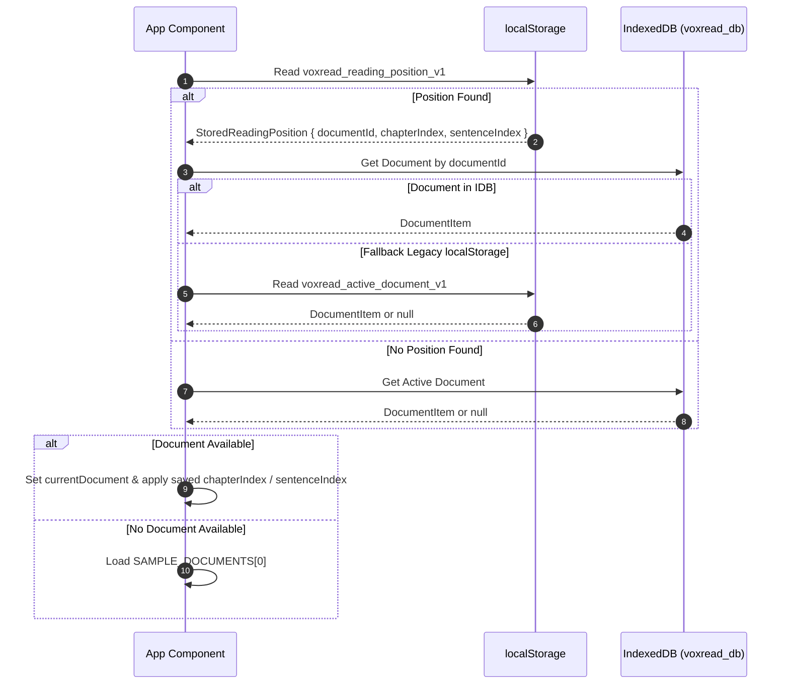
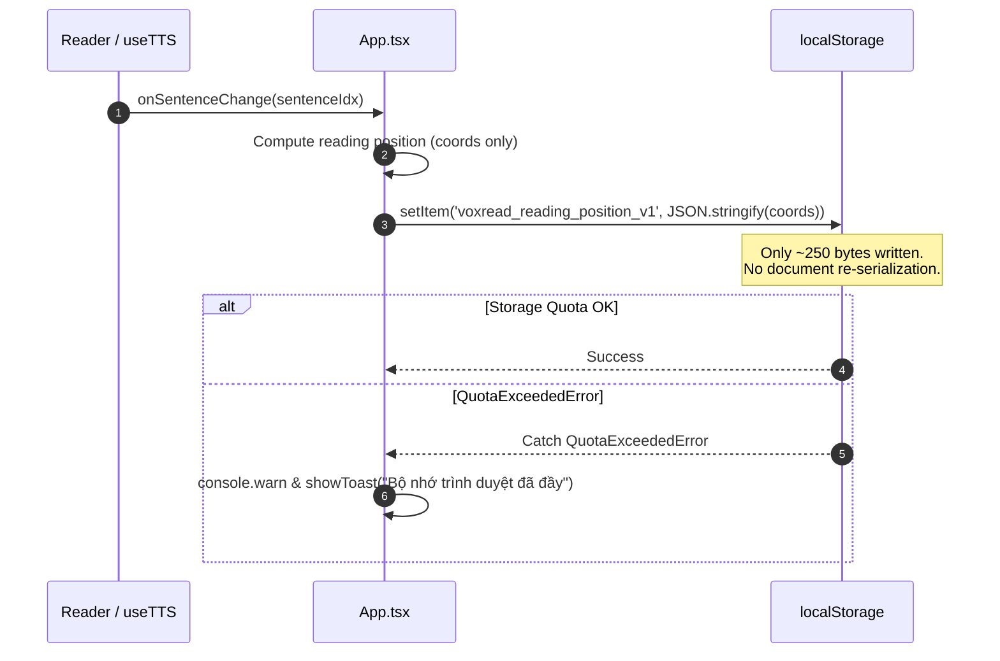

# Data Model & Storage Specifications: Core Stability & Data Integrity

**Feature Branch**: `002-core-stability-fixes`  
**Date**: 2026-09-02  
**Status**: Completed  
**Spec**: [spec.md](./spec.md)

---

## 1. Storage Architecture Overview

VoxRead operates with a two-tier persistent storage design:
1. **Tier 1: High-Frequency LocalStorage**: Dedicated exclusively to lightweight session coordinates and user settings.
2. **Tier 2: High-Capacity IndexedDB**: Dedicated to storing parsed book hierarchies (chapters, paragraphs, sentences).

```
┌────────────────────────────────────────────────────────────────────────┐
│                              Application                               │
└───────────────────┬────────────────────────────────┬───────────────────┘
                    │ (Every sentence / chapter)     │ (On document import/switch)
                    ▼                                ▼
       ┌───────────────────────────┐   ┌───────────────────────────┐
       │       localStorage        │   │         IndexedDB         │
       │───────────────────────────│   │───────────────────────────│
       │ voxread_reading_position  │   │ DB: voxread_db            │
       │ (~250 bytes)              │   │ Store: documents          │
       │ Fast, synchronous, light  │   │ Key: documentId           │
       │ Zero quota exhaustion     │   │ Large payload (~50MB+)    │
       └───────────────────────────┘   └───────────────────────────┘
```

---

## 2. Core Entities & Schemas

### 2.1 Reading Position (`StoredReadingPosition`)
Stored in `localStorage` under key `voxread_reading_position_v1`.

```ts
export interface StoredReadingPosition {
  /** Identifier of the document this position belongs to */
  documentId: string;
  /** Active chapter index (0-indexed) */
  chapterIndex: number;
  /** Active sentence index in the current chapter (0-indexed) */
  sentenceIndex: number;
  /** Reading progress percentage across current chapter (0 - 100) */
  progressPercentage: number;
  /** Unix timestamp of last update in milliseconds */
  updatedAt: number;
}
```

**Validation & Invariant Rules:**
- `documentId`: non-empty string.
- `chapterIndex`: integer $\ge 0$.
- `sentenceIndex`: integer $\ge 0$.
- `progressPercentage`: integer $0 \le \text{progressPercentage} \le 100$.
- `updatedAt`: positive integer timestamp.

---

### 2.2 Stored Document (`DocumentItem`)
Stored in IndexedDB database `voxread_db`, object store `documents`, keyPath `id`.

```ts
export interface DocumentItem {
  id: string;
  title: string;
  author?: string;
  format: 'txt' | 'pdf' | 'epub';
  chapters: Chapter[];
  createdAt: number;
  lastRead?: {
    chapterIndex: number;
    sentenceIndex: number;
    progressPercentage: number;
    updatedAt: number;
  };
  totalWords: number;
  totalSentences: number;
}

export interface Chapter {
  id: string;
  title: string;
  paragraphs: ParagraphItem[];
  totalSentences: number;
  wordCount: number;
}

export interface ParagraphItem {
  id: string;
  sentences: SentenceItem[];
}

export interface SentenceItem {
  id: string;
  globalIndex: number;
  paragraphIndex: number;
  sentenceIndex: number;
  text: string;
}
```

**IndexedDB Parameters:**
- Database Name: `voxread_db`
- Database Version: `1`
- Object Store Name: `documents`
- Primary Key: `id` (string)
- Metadata Store / Key: Key `'active_document_id'` holds the currently active document ID.

---

### 2.3 Reading Statistics Models (Honest Zero-State)

Stored in `localStorage` under:
- `STATS_STORAGE_KEY`: `'voxread_daily_reading_stats_v1'`
- `SESSIONS_STORAGE_KEY`: `'voxread_recent_sessions_v1'`

```ts
export interface DailyReadingStatRecord {
  durationMinutes: number;
  wordsRead: number;
  sessionsCount: number;
}

export type DailyDataMap = Record<string, DailyReadingStatRecord>;

export interface ReadingSessionRecord {
  id: string;
  timestamp: number;
  documentTitle: string;
  chapterTitle: string;
  durationSeconds: number;
  wordsRead: number;
  wpm: number;
}
```

**Zero-State Default Initialization:**
- `dailyDataMap`: `{}` (empty object, no fake days).
- `recentSessions`: `[]` (empty array, no fake sessions).
- When `dailyDataMap` is empty, helper generates last 7 day slots with `0` duration, `0` words, and `0` sessions.

---

### 2.4 Upload Guard & File Validation

```ts
export interface UploadValidationConfig {
  maxSizeMB: number;         // 100
  maxSizeBytes: number;      // 104,857,600 bytes (100 * 1024 * 1024)
  allowedExtensions: string[]; // ['txt', 'pdf', 'epub', 'md', 'text']
}

export interface ParseOptions {
  onProgress?: (percent: number) => void;
  signal?: AbortSignal;
}
```

**Validation Rules:**
- If `file.size > maxSizeBytes`: immediately throw validation error without reading file into memory.
- If extension not in `allowedExtensions`: reject with unsupported format error.

---

### 2.5 Error Boundary State

```ts
export interface ErrorBoundaryState {
  hasError: boolean;
  error: Error | null;
  errorInfo: React.ErrorInfo | null;
}

export interface ErrorBoundaryProps {
  children: React.ReactNode;
  fallbackTitle?: string;
  fallbackDescription?: string;
  isContentOnly?: boolean;
  onResetToSample?: () => void;
}
```

---

## 3. State Transitions & Lifecycle

### Document Loading & Position Restoration Flow


### Sentence Advancement Flow (Decoupled Persistence)

