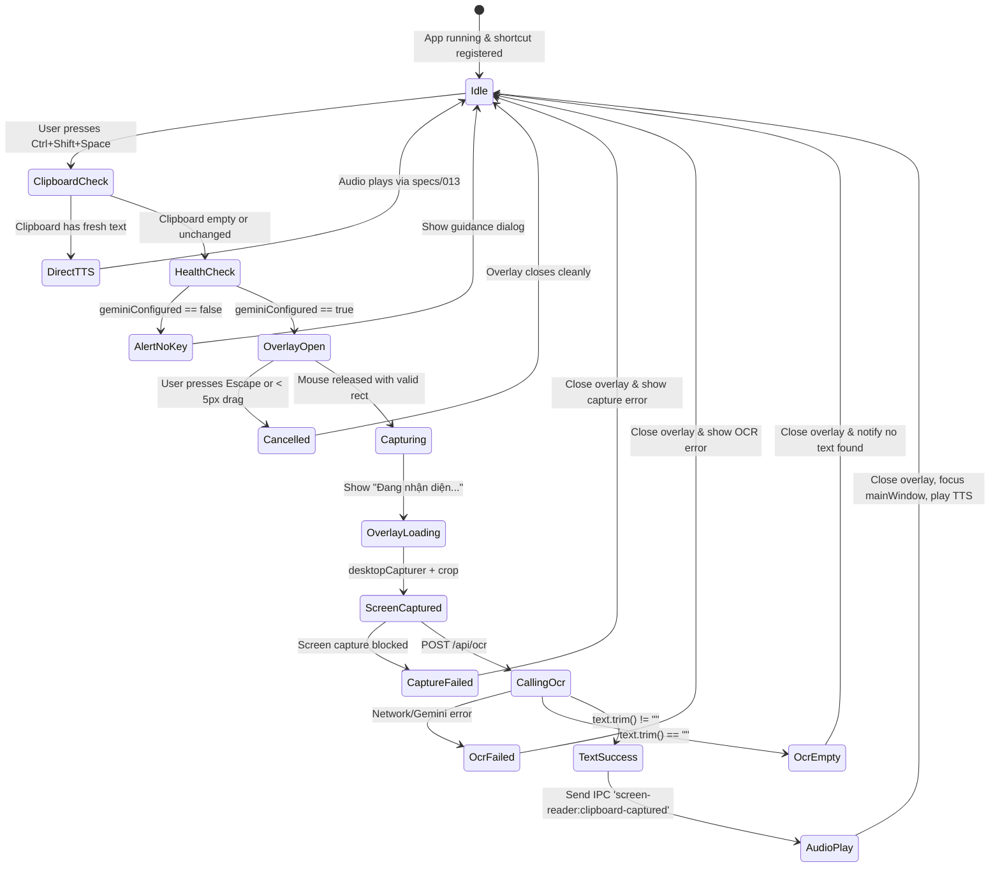
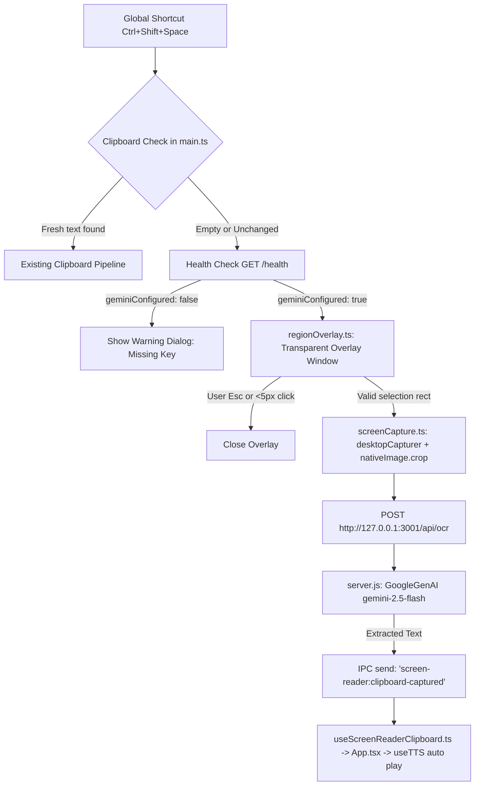

# Data Model & Architecture: Desktop OCR Screen Reader Fallback

**Feature**: `014-ocr-screen-reader`  
**Date**: 2026-09-04  

---

## 1. Entities & Data Structures

### 1.1 Region Rectangle (`RegionRect`)
Represents the spatial coordinates of the selected rectangular area on the primary screen.

| Field | Type | Required | Description |
|---|---|---|---|
| `x` | `number` | Yes | Top-left X coordinate in logical screen pixels (≥ 0). |
| `y` | `number` | Yes | Top-left Y coordinate in logical screen pixels (≥ 0). |
| `width` | `number` | Yes | Width of selected region in pixels (minimum valid: 5). |
| `height` | `number` | Yes | Height of selected region in pixels (minimum valid: 5). |

### 1.2 OCR Request (`OcrRequestPayload`)
HTTP JSON payload sent by the Electron main process to Express `POST /api/ocr`.

| Field | Type | Required | Description |
|---|---|---|---|
| `image` | `string` | Yes | Base64-encoded PNG image data. May optionally start with data URI prefix (`data:image/png;base64,`). Max decoded size: 15MB. |

### 1.3 OCR Success Response (`OcrSuccessResponse`)
HTTP 200 response returned by Express `POST /api/ocr`.

| Field | Type | Required | Description |
|---|---|---|---|
| `ok` | `boolean` | Yes | Always `true`. |
| `text` | `string` | Yes | Verbatim plain text extracted from image (may be empty if no text found). |

### 1.4 OCR Error Response (`OcrErrorResponse`)
HTTP 400 / 500 / 503 error response returned by Express `POST /api/ocr`.

| Field | Type | Required | Description |
|---|---|---|---|
| `ok` | `boolean` | Yes | Always `false`. |
| `error` | `string` | Yes | Localized Vietnamese explanation of the failure. |

---

## 2. State Transition & Execution Flow

---

## 3. Component Architecture

