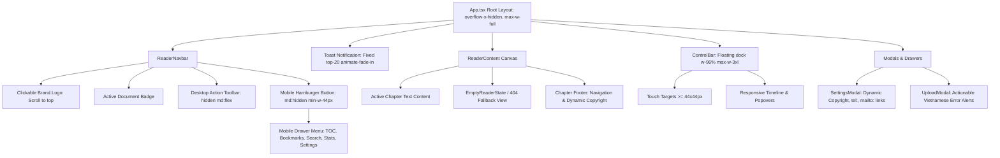

# Data Model & UI Architecture: UI/UX & Responsive Optimization

**Feature**: `015-ui-ux-optimization`  
**Date**: 2026-09-04  

---

## 1. UI State Entities

### 1.1 Mobile Menu State
Controls the visibility and interaction flow of the mobile hamburger navigation drawer in `ReaderNavbar.tsx`.

| Field | Type | Default | Description |
|---|---|---|---|
| `isMobileMenuOpen` | `boolean` | `false` | Whether the mobile navigation slide-down drawer is currently active. |

### 1.2 Toast Notification State
Controls user feedback alerts across the app in `App.tsx`.

| Field | Type | Default | Description |
|---|---|---|---|
| `toastMessage` | `string \| null` | `null` | Active text message to display. Auto-dismisses after 2400ms. |
| `toastType` | `'info' \| 'success' \| 'error'` | `'success'` | Visual style and accent color of the toast pill. |

### 1.3 Empty / 404 Reader State
Renders when `!currentDocument` or `currentDocument.chapters.length === 0`.

| Field | Type | Required | Description |
|---|---|---|---|
| `onOpenUpload` | `() => void` | Yes | Callback to prompt file upload modal. |
| `onResetToSample` | `() => void` | Yes | Callback to reload default sample novel. |

---

## 2. Component Hierarchy & Layout Tree

