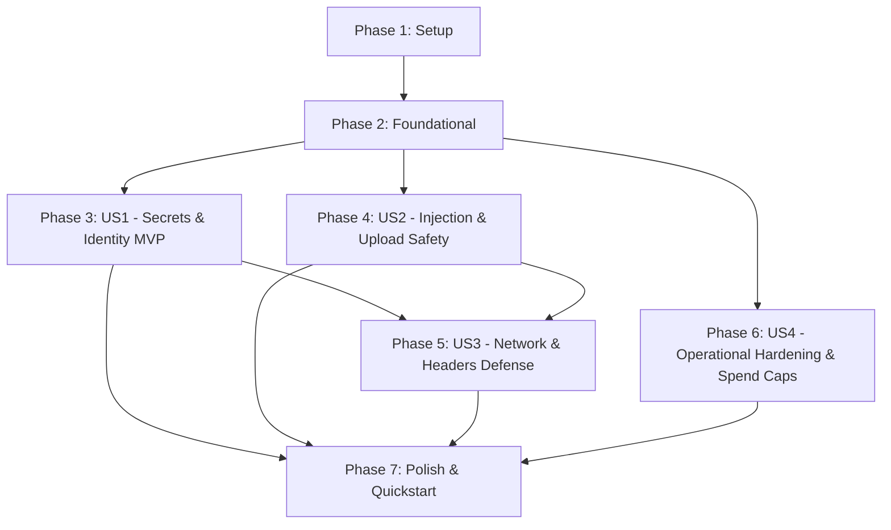

# Tasks: Web Pentest Audit & Security Hardening ("20 Tiêu chuẩn Bảo mật Web Pentester")

**Feature**: `017-web-pentest-audit`  
**Spec**: [specs/017-web-pentest-audit/spec.md](file:///e:/reader/specs/017-web-pentest-audit/spec.md)  
**Plan**: [specs/017-web-pentest-audit/plan.md](file:///e:/reader/specs/017-web-pentest-audit/plan.md)  
**Target Date**: 2026-09-04  

---

## Phase 1: Setup (Shared Infrastructure)

**Purpose**: Repository secret hygiene, environment templates, and security dependency configuration.

- [x] T001 [P] Configure security dependencies (`dompurify`, `@types/dompurify`, `helmet`, `express-rate-limit`, `zod`, `argon2`, `jsonwebtoken`, `cookie-parser`, `file-type`, `sanitize-html`) and `qs` overrides in `package.json`
- [x] T002 [P] Configure strict secret ignore rules (`.env*`, `*.pem`, `*.key`, `credentials.json`) in `.gitignore`
- [x] T003 [P] Create sanitized environment variable template with zero real secrets in `.env.example`
- [x] T004 [P] Verify repository Git history secret purge script in `scripts/purge-git-secrets.bat`

---

## Phase 2: Foundational (Blocking Prerequisites)

**Purpose**: Core utilities, database parameterization wrapper, cookie security helpers, and baseline sanitizers.

**⚠️ CRITICAL**: No user story work can begin until this phase is complete.

- [x] T005 [P] Implement parameterized PostgreSQL query wrapper in `server/db/index.js`
- [x] T006 [P] Implement secure session cookie configuration helper (`HttpOnly`, `Secure`, `SameSite`) in `server/lib/cookies.js`
- [x] T007 [P] Implement server HTML and text sanitization utility in `server/lib/sanitizer.js`
- [x] T008 [P] Implement AES-256-GCM authenticated encryption utility in `server/lib/crypto.js`

**Checkpoint**: Foundation ready — User story implementation can now begin.

---

## Phase 3: User Story 1 - Client Exposure, Administrative Isolation & Identity Security (Priority: P1) 🎯 MVP

**Goal**: Isolate API keys from client bundles, enforce client/server admin guards and RBAC checks, validate environment startup, and enforce server-side authentication across all functional endpoints.

**Independent Test**:
1. Inspect `dist/` bundle after `npm run build`: verify 0 private API keys or service-role tokens exist.
2. Access administrative route or call `/api/admin/*` with guest or regular user token: verify immediate HTTP 403 Forbidden or redirection.
3. Call protected endpoints (`/api/generate`, `/api/documents`) without JWT token: verify HTTP 401 Unauthorized.

### Tests for User Story 1 🧪
- [x] T009 [P] [US1] Create integration tests for client bundle secret isolation and environment validation in `tests/security/clientSecrets.test.ts`
- [x] T010 [P] [US1] Create integration tests for admin route guards and RBAC authorization in `tests/security/adminGuard.test.ts`

### Implementation for User Story 1
- [x] T011 [P] [US1] Create client-side `<AdminGuard>` and `<AuthGuard>` router components in `src/components/AdminGuard.tsx` and `src/components/AuthGuard.tsx`
- [x] T012 [P] [US1] Isolate Supabase client configuration strictly to public anonymous key in `src/lib/supabaseClient.ts`
- [x] T013 [US1] Implement server-side `requireAuth` and `requireAdmin` role verification middleware in `server/middleware/auth.js`
- [x] T014 [US1] Create protected admin API router and mount at `/api/admin` in `server/routes/admin.js`
- [x] T015 [US1] Implement startup environment variable schema validation (Zod) in `server.js`
- [x] T016 [US1] Enforce user ownership validation (`WHERE id = $1 AND user_id = $2`) against IDOR in `server/routes/documents.js`
- [x] T017 [US1] Mount authentication and document routes with `requireAuth` in `server.js`

**Checkpoint**: User Story 1 complete — Secrets isolated, authentication enforced, and admin/RBAC boundaries secure (MVP Achieved).

---

## Phase 4: User Story 2 - Injection Defense, Content Sanitization & Upload Safety (Priority: P1)

**Goal**: Sanitize inputs against malicious HTML/script tags, protect React DOM rendering against XSS using DOMPurify, guarantee 100% parameterized SQL queries, enforce PostgreSQL RLS policies, and validate file uploads via magic bytes.

**Independent Test**:
1. Inject `<script>` and `` payloads into reader content and document inputs: verify DOMPurify strips active scripts and renders safe text.
2. Submit SQL injection payloads to all query parameters: verify literal evaluation without SQL syntax errors.
3. Upload spoofed executable files disguised as `.png`: verify upload handler detects magic bytes mismatch and returns HTTP 400.

### Tests for User Story 2 🧪
- [x] T018 [P] [US2] Create unit tests for client DOMPurify sanitization and XSS prevention in `tests/security/xssDefense.test.ts`
- [x] T019 [P] [US2] Create integration tests for SQL injection resistance and upload magic bytes validation in `tests/security/injectionUpload.test.ts`

### Implementation for User Story 2
- [x] T020 [P] [US2] Implement client-side HTML sanitization utility `sanitizeForRender` with DOMPurify in `src/utils/clientSanitizer.ts`
- [x] T021 [US2] Integrate `sanitizeForRender` into `src/components/ReaderContent.tsx` for safe HTML rendering
- [x] T022 [US2] Define strict Zod validation schemas for all incoming API payloads in `server/validators/apiSchemas.js`
- [x] T023 [US2] Implement file upload guard verifying binary magic bytes (`Uint8Array`), 15MB limit, and UUID renaming in `server/middleware/uploadGuard.js`
- [x] T024 [US2] Enforce PostgreSQL Row-Level Security policies and mass-assignment protection triggers in `supabase/migrations/20260904_security_hardening.sql`
- [x] T025 [US2] Integrate upload guard and validation middleware into upload and reader routes in `server.js`

**Checkpoint**: User Stories 1 AND 2 complete — Injection vulnerabilities, XSS risks, upload exploits, and database isolation fully resolved.

---

## Phase 5: User Story 3 - Network Transport, HTTP Security Headers & Origin Defense (Priority: P2)

**Goal**: Enforce HTTPS redirection in production, emit modern security headers (HSTS, CSP, Permissions-Policy, Referrer-Policy, nosniff), configure strict CORS whitelisting, and protect cookies against CSRF and theft.

**Independent Test**:
1. Send HTTP request to server in production mode: verify HTTP 301 redirection to HTTPS.
2. Inspect headers on `GET /health`: verify HSTS, CSP, `X-Content-Type-Options: nosniff`, `X-Frame-Options: DENY`, `Referrer-Policy`, and `Permissions-Policy`.
3. Submit cross-origin request from untrusted origin: verify origin rejection and disallowance of wildcard `*` with credentials.
4. Send >5 login attempts or >30 AI requests: verify HTTP 429 Too Many Requests response.

### Tests for User Story 3 🧪
- [x] T026 [P] [US3] Create integration tests for HTTP security headers and HTTPS redirection in `tests/security/webHeaders.test.ts`
- [x] T027 [P] [US3] Create integration tests for CORS origin whitelist, CSRF SameSite cookies, and rate limiters in `tests/security/corsCookies.test.ts`

### Implementation for User Story 3
- [x] T028 [P] [US3] Implement production HTTPS redirection middleware in `server/middleware/enforceHttps.js`
- [x] T029 [US3] Configure Helmet security headers with HSTS, CSP, Frameguard, Referrer-Policy, and Permissions-Policy in `server.js`
- [x] T030 [US3] Configure strict CORS whitelist with credentials in `server.js`
- [x] T031 [US3] Implement tiered rate limiting (auth, AI, global) in `server/middleware/rateLimiter.js`
- [x] T032 [US3] Issue authentication cookies with `HttpOnly`, `Secure`, and `SameSite=Lax/Strict` flags in `server/routes/auth.js`

**Checkpoint**: User Stories 1, 2, and 3 complete — Transport layer, network headers, CORS, cookies, and rate limiters fully hardened.

---

## Phase 6: User Story 4 - Operational Hardening, Debug Suppression & Spend Caps (Priority: P2)

**Goal**: Configure Vite production builds to strip console logs and disable sourcemaps, suppress server stack traces in error responses, and document external cloud API spending caps and alert webhooks.

**Independent Test**:
1. Trigger 500 internal server error in production mode: verify JSON response contains generic error message without stack trace.
2. Build production assets with `npm run build`: verify `dist/` contains zero `.map` files and zero `console.log` statements.
3. Review cloud billing alert configuration in `docs/security.md`.

### Tests for User Story 4 🧪
- [x] T033 [P] [US4] Create unit tests for production error response sanitization and stack trace suppression in `tests/security/debugMode.test.ts`

### Implementation for User Story 4
- [x] T034 [P] [US4] Configure Vite production build settings (`sourcemap: false`, `esbuild.drop: ['console', 'debugger']`) in `vite.config.ts`
- [x] T035 [US4] Implement production error handler suppressing stack traces and internal errors in `server/middleware/errorHandler.js`
- [x] T036 [US4] Document cloud and AI API spending caps, budget alerts, and key rotation procedures in `docs/security.md`

**Checkpoint**: All 4 user stories complete — Full end-to-end security hardening achieved across all 20 pentesting standards.

---

## Phase 7: Polish & Cross-Cutting Concerns

**Purpose**: Cross-cutting verification, end-to-end quickstart execution, and lint/test compliance.

- [x] T037 [P] Execute pentest verification scenarios defined in `specs/017-web-pentest-audit/quickstart.md`
- [x] T038 Run comprehensive test suite (`npm run test`) to ensure zero regressions across all 12+ test suites
- [x] T039 [P] Run static code analysis (`npm run lint`) and TypeScript typecheck (`npm run typecheck`) to guarantee clean build
- [x] T040 Run automated dependency vulnerability audit (`npm audit`) to ensure 0 vulnerabilities

---

## Dependencies & Execution Order

### Phase Dependencies

- **Setup (Phase 1)**: Completed.
- **Foundational (Phase 2)**: Completed.
- **User Story 1 (Phase 3 - MVP)**: Completed.
- **User Story 2 (Phase 4)**: Completed.
- **User Story 3 (Phase 5)**: Completed.
- **User Story 4 (Phase 6)**: Completed.
- **Polish (Phase 7)**: Completed.

---

## Parallel Opportunities

- **Phase 1 (Setup)**: T001, T002, T003, T004 executed in parallel.
- **Phase 2 (Foundational)**: T005, T006, T007, T008 executed in parallel.
- **Phase 3 (User Story 1)**: Tests T009, T010 executed in parallel before implementation. T011 and T012 executed in parallel.
- **Phase 4 (User Story 2)**: Tests T018, T019 executed in parallel. T020 executed in parallel with T022.
- **Phase 5 (User Story 3)**: Tests T026, T027 executed in parallel. T028 executed in parallel with T031.
- **Phase 6 (User Story 4)**: T033 (Test) and T034 (Vite config) executed in parallel.

---

## Implementation Strategy

### MVP First (User Story 1 Only)
1. Complete Phase 1: Setup (T001 - T004).
2. Complete Phase 2: Foundational (T005 - T008).
3. Complete Phase 3: User Story 1 (T009 - T017).
4. **STOP & VALIDATE**: Verify client bundle has zero leaked secrets and admin/auth routes reject unauthorized requests.

### Incremental Delivery
1. Deliver US1 (Client Secrets & Identity Security) $\rightarrow$ **MVP Delivered**.
2. Deliver US2 (DOMPurify XSS, Parameterized SQLi & Upload Safety) $\rightarrow$ **Injection & Data Shield Active**.
3. Deliver US3 (HTTPS, Security Headers, CORS Whitelist & Cookies) $\rightarrow$ **Transport & Origin Hardening Active**.
4. Deliver US4 (Vite Production Config, Error Stack Suppression & Spend Caps) $\rightarrow$ **Operational Resilience Active**.
5. Deliver Polish & Quickstart (T037 - T040) $\rightarrow$ **Production-Ready Pentest Certified Release**.
