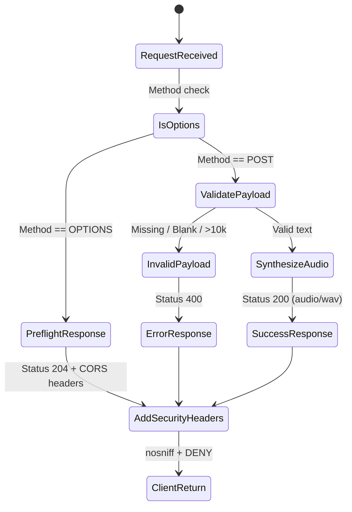

# Data Model & Schema: TTS CORS Preflight Configuration

**Feature**: `019-fix-tts-cors-preflight`  
**Date**: 2026-09-04  

---

## 1. Entities

### Entity 1: `PreflightRequest`
Represents an incoming HTTP OPTIONS preflight request dispatched by browser fetch/XHR clients prior to cross-origin POST execution.

| Field | Type | Mandatory | Validation / Constraints | Description |
|:---|:---|:---|:---|:---|
| `method` | `string` | Yes | Must be `"OPTIONS"` | HTTP method |
| `path` | `string` | Yes | Must be `"/speak"` | Target endpoint |
| `headers.Origin` | `string` | No | Optional URL string | Request origin (may be absent in test clients) |
| `headers.Access-Control-Request-Method` | `string` | No | Usually `"POST"` | Method client wishes to invoke |
| `headers.Access-Control-Request-Headers` | `string` | No | Usually `"Content-Type"` | Headers client wishes to send |

---

### Entity 2: `PreflightResponse`
Represents the HTTP response returning authorization for cross-origin communication.

| Field / Header | Type | Value / Constraint | Purpose |
|:---|:---|:---|:---|
| `status_code` | `integer` | `204` | No Content |
| `Access-Control-Allow-Origin` | `string` | `*` | Permits cross-origin invocation |
| `Access-Control-Allow-Methods` | `string` | `"POST, OPTIONS"` | Allowed HTTP methods |
| `Access-Control-Allow-Headers` | `string` | `"Content-Type, Authorization"` | Allowed client request headers |
| `X-Content-Type-Options` | `string` | `"nosniff"` | MIME type sniffing mitigation |
| `X-Frame-Options` | `string` | `"DENY"` | Clickjacking mitigation |
| `body` | `bytes` | `b""` | Empty payload |

---

### Entity 3: `SynthesisRequest` (POST /speak)
Existing core entity representing text-to-speech conversion requests.

| Field | Type | Mandatory | Validation Rules | Description |
|:---|:---|:---|:---|:---|
| `text` | `string` | Yes | Non-empty, non-whitespace, max 10,000 characters | Vietnamese/multilingual text to read |
| `language` | `string` | No | Optional, defaults to `"vi"` | Target synthesis language code |

---

### Entity 4: `SynthesisResponse` (POST /speak)

| Scenario | Status | Content-Type | Payload |
|:---|:---|:---|:---|
| Success | `200 OK` | `audio/wav` | Raw RIFF/WAVE binary stream |
| Validation Error | `400 Bad Request` | `application/json` | `{"error": "Thieu 'text'..."}` |
| Server Error | `500 Internal Error`| `application/json` | `{"error": "Đã xảy ra lỗi..."}` |

---

## 2. Invariants & Lifecycle States

