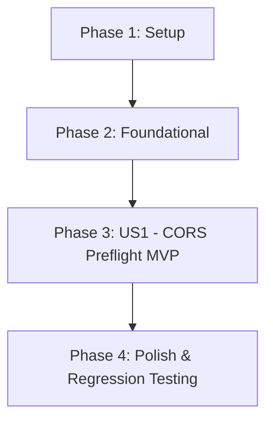

# Tasks: TTS CORS Preflight Support for /speak

**Feature**: `019-fix-tts-cors-preflight`  
**Spec**: [specs/019-fix-tts-cors-preflight/spec.md](file:///e:/reader/specs/019-fix-tts-cors-preflight/spec.md)  
**Plan**: [specs/019-fix-tts-cors-preflight/plan.md](file:///e:/reader/specs/019-fix-tts-cors-preflight/plan.md)  
**Target Date**: 2026-09-04  

---

## Phase 1: Setup (Shared Infrastructure)

**Purpose**: Verify environment readiness and reproduce the failing test baseline.

- [x] T001 Verify Python testing environment and reproduce failing test via `.\python-backend\venv\Scripts\pytest.exe python-backend/tests/test_server.py -k test_speak_options_preflight_returns_cors_headers`

---

## Phase 2: Foundational (Blocking Prerequisites)

**Purpose**: Baseline inspection of existing routing and middleware in `python-backend/server.py`.

- [x] T002 Inspect existing CORS routing in `speak()` and `@app.after_request` in `python-backend/server.py`

**Checkpoint**: Baseline verified — Ready to implement User Story 1.

---

## Phase 3: User Story 1 - Cross-Origin TTS Preflight Support (Priority: P1) 🎯 MVP

**Goal**: Ensure `OPTIONS /speak` returns HTTP status 204 with required CORS headers (`Access-Control-Allow-Origin: *`, `Access-Control-Allow-Methods: POST, OPTIONS`, `Access-Control-Allow-Headers: Content-Type, Authorization`) while preserving existing security headers (`X-Content-Type-Options: nosniff`, `X-Frame-Options: DENY`) and TTS synthesis logic.

**Independent Test**:
1. Run `.\python-backend\venv\Scripts\pytest.exe python-backend/tests/test_server.py -k test_speak_options_preflight_returns_cors_headers -v`: verifies status 204 and CORS headers.
2. Run `.\python-backend\venv\Scripts\pytest.exe python-backend/tests -v`: all 5 tests pass (100%).

### Implementation for User Story 1
- [x] T003 [US1] Update `speak()` in `python-backend/server.py` to return `Response(status=204)` with explicit CORS headers (`Access-Control-Allow-Origin: *`, `Access-Control-Allow-Methods: POST, OPTIONS`, `Access-Control-Allow-Headers: Content-Type, Authorization`)
- [x] T004 [US1] Update `_add_cors_headers()` in `python-backend/server.py` to preserve pre-existing CORS headers without overwriting and maintain `X-Content-Type-Options: nosniff` and `X-Frame-Options: DENY`

**Checkpoint**: User Story 1 complete — `OPTIONS /speak` preflight succeeds and test passes (MVP Achieved).

---

## Phase 4: Polish & Cross-Cutting Concerns

**Purpose**: Validate regression avoidance across all endpoints and verify strict scope isolation.

- [x] T005 [P] Execute targeted preflight test via `.\python-backend\venv\Scripts\pytest.exe python-backend/tests/test_server.py -k test_speak_options_preflight_returns_cors_headers -v`
- [x] T006 Execute full test suite via `.\python-backend\venv\Scripts\pytest.exe python-backend/tests -v` to confirm all 5 tests pass
- [x] T007 [P] Verify git modifications are confined strictly to `python-backend/server.py` via `git diff python-backend/`

---

## Dependencies & Execution Order

### Phase Dependencies

- **Setup (Phase 1)**: Independent — validates existing test failure.
- **Foundational (Phase 2)**: Verifies touch points in `python-backend/server.py`.
- **User Story 1 (Phase 3 - MVP)**: Surgical update to endpoint and after_request hook.
- **Polish (Phase 4)**: Verification of zero regressions across all 5 tests and clean git diff.

---

## Parallel Opportunities

- **Phase 4 (Polish)**: T005 and T007 can execute in parallel.

---

## Implementation Strategy

### MVP First (User Story 1 Only)
1. Complete Phase 1: Setup (T001).
2. Complete Phase 2: Foundational (T002).
3. Complete Phase 3: User Story 1 (T003 - T004).
4. **STOP & VALIDATE**: Run `pytest.exe` on targeted test (T005).
5. Complete Phase 4: Polish & Full Suite Verification (T006 - T007).
