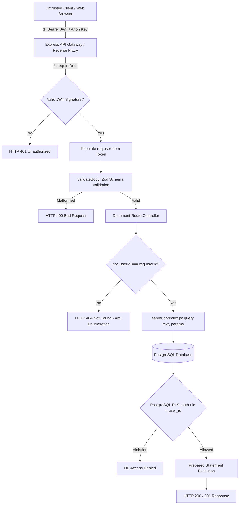

# Implementation Plan: AppSec Core Hardening: Auth Ownership, Parameterized Queries & Frontend Key Isolation with RLS

**Branch**: `021-appsec-audit-hardening` | **Date**: 2026-09-04 | **Spec**: [specs/021-appsec-audit-hardening/spec.md](spec.md)

**Input**: Feature specification from `/specs/021-appsec-audit-hardening/spec.md`

---

## Summary

This implementation plan hardens the 3 core security pillars of the VoxRead platform:
1. **Broken Access Control & IDOR Defense**: Enforces server-side token identity verification across all document, bookmark, and user data routes. Strict ownership checks (`doc.userId === req.user.id` / `WHERE id = $1 AND user_id = $2`) reject unauthorized cross-account access with HTTP 404 to avoid resource enumeration.
2. **Database Injection & SQLi Elimination**: Enforces parameterized queries (`$1, $2, ...`) across 100% of backend database operations via the `server/db/index.js` connection pool wrapper. Eliminates all string interpolation, enforcing Zod schema validation before queries reach the database layer.
3. **Frontend Key Isolation & Row-Level Security (RLS)**: Enforces least-privilege client access using only `VITE_SUPABASE_ANON_KEY`. Isolates all administrative credentials, database connection strings, and service-role keys in server-side `.env`. Protects 100% of PostgreSQL tables with active RLS policies and privilege escalation triggers.

---

## Technical Context

**Language/Version**: TypeScript 5.8, Node.js 18+, ECMAScript Modules (ESM)  
**Primary Dependencies**: Express 4, Helmet 8, Zod 4, Argon2 0.45, JSONWebToken 9, pg (PostgreSQL Client Pool)  
**Storage**: PostgreSQL with `pgcrypto` & Supabase RLS policies / In-memory tenant stores for local standalone mode  
**Testing**: Vitest 4 with dedicated security suites (`tests/security/*.test.ts`)  
**Target Platform**: Modern Web Browsers & Node.js Production Server  
**Performance Goals**: Sub-5ms database authorization overhead; zero leakage of internal database schemas or stack traces  
**Security Standards**: OWASP Top 10 (A01: Broken Access Control, A02: Cryptographic Failures, A03: Injection, A05: Security Misconfiguration)

---

## Constitution Check

*GATE: Must pass before Phase 0 research. Re-check after Phase 1 design.*

| Principle / Gate | Assessment | Status |
|:---|:---|:---|
| **I. Library-First & Modularity** | Security middleware (`auth.js`, `validate.js`), DB wrapper (`db/index.js`), and migration policies are self-contained and modular. | **PASS** |
| **II. CLI & Operational Interfaces** | Security audit scripts, test suites, and migrations can be run and verified via standard CLI tools (`npm run test`, psql, vitest). | **PASS** |
| **III. Test-First (TDD)** | Verification scenarios and security test contracts are defined in `quickstart.md` and `tests/security/`. | **PASS** |
| **IV. Integration Testing** | End-to-end integration tests validate cross-account isolation, SQL injection resilience, and client bundle secrets. | **PASS** |
| **V. Simplicity & YAGNI** | Native parameterized queries and standard RLS policies avoid bloated ORM dependencies. | **PASS** |

*Constitution Gate Result*: **ALL CHECKS PASSED**.

---

## Project Structure

### Documentation (this feature)

```text
specs/021-appsec-audit-hardening/
├── spec.md              # Feature specification
├── plan.md              # This file (Implementation Plan)
├── research.md          # Phase 0 output: Analysis & architectural decisions
├── data-model.md        # Phase 1 output: Entity schemas, validation & RLS rules
├── quickstart.md        # Phase 1 output: Runnable validation & penetration test guide
├── contracts/
│   └── appsec-contracts.md # Phase 1 output: API, Query, and RLS interface contracts
└── checklists/
    └── requirements.md  # Specification quality checklist
```

### Source Code & Test Structure (repository root)

```text
server/
├── db/
│   └── index.js             # Parameterized query wrapper ($1, $2) with pg pool
├── middleware/
│   ├── auth.js              # Token verification, identity extraction (req.user)
│   ├── validate.js          # Zod schema validation middleware
│   └── errorHandler.js      # Production error sanitization (zero stack leaks)
├── routes/
│   ├── documents.js         # Strict ownership checks (WHERE id = $1 AND user_id = $2)
│   ├── auth.js              # Password hashing & session token issuance
│   └── admin.js             # RBAC admin endpoints
└── validators/
    └── apiSchemas.js        # Zod input schemas for payloads

src/
└── lib/
    └── supabaseClient.ts    # Frontend client restricted to public anon key

supabase/
└── migrations/
    └── 20260904_security_hardening.sql # 100% RLS coverage, tenant isolation, triggers

tests/
└── security/
    ├── adminGuard.test.ts   # RBAC admin protection verification
    ├── authHardening.test.ts# Argon2id password verification
    ├── clientSecrets.test.ts# Secret scanning of client assets
    ├── rlsIsolation.test.ts # RLS tenant policy validation
    └── injectionUpload.test.ts # Injection defense validation
```

---

## Architecture & Defense-in-Depth Mapping



---

## Planned Phases

1. **Phase 0: Outline & Research** (`research.md`):
   - Formalize defense rationale against IDOR, SQLi, and secret leakage.
   - Establish anti-enumeration conventions (404 vs 403).
   - Document RLS policy hierarchy and trigger safeguards.

2. **Phase 1: Design & Contracts** (`data-model.md`, `contracts/appsec-contracts.md`, `quickstart.md`):
   - Model `UserSession`, `DocumentRecord`, `ParameterizedQuery`, and `RLSPolicyDefinition`.
   - Specify endpoint contracts with ownership validation.
   - Detail penetration test validation suites in quickstart guide.
