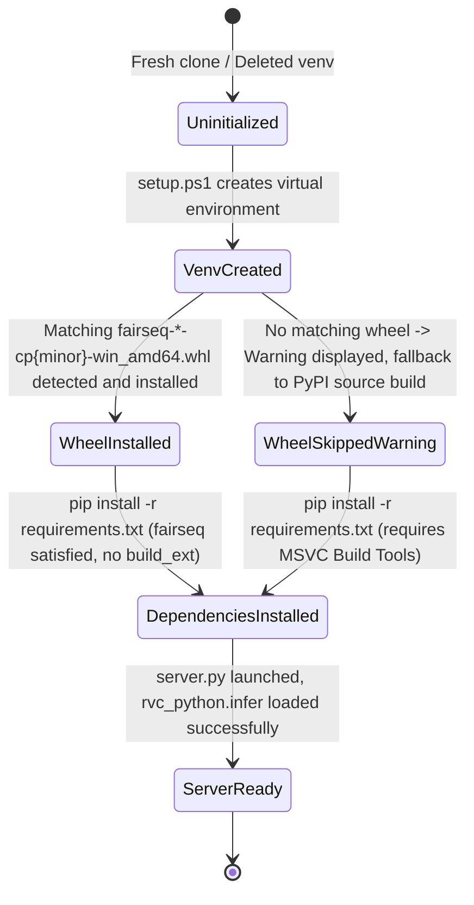

# Data Model & Entity Specifications: Zero-Compiler Windows Setup

**Feature**: [spec.md](./spec.md) | **Directory**: `specs/022-vendor-fairseq-wheel`

---

## Entities

### 1. Vendored Wheel Artifact (`WheelArtifact`)

Represents the binary package vendored in the repository to satisfy native extension dependencies without compilation.

| Field | Type | Description | Example / Constraints |
|---|---|---|---|
| `packageName` | String | Name of the Python distribution | `fairseq` |
| `version` | String | Semantic version of the distribution | `0.12.2` |
| `pythonTag` | String | Python interpreter implementation and minor version | `cp310` |
| `abiTag` | String | ABI tag matching interpreter | `cp310` |
| `platformTag` | String | Operating system and CPU architecture | `win_amd64` |
| `relativePath` | String | Path relative to repository root | `python-backend/wheels/fairseq-0.12.2-cp310-cp310-win_amd64.whl` |
| `fileSizeBytes` | Integer | Size of the pre-compiled wheel package | ~5-15 MB |

**Validation Rules**:
- File name MUST strictly follow PEP 427 convention: `{distribution}-{version}(-{build tag})?-{python tag}-{abi tag}-{platform tag}.whl`.
- The wheel MUST contain pre-compiled binary extensions (`*.pyd`, specifically `libbleu*.pyd`).

---

### 2. Environment Runtime Context (`EnvironmentContext`)

Represents the host system state inspected by the setup scripts.

| Property | Type | Description | Expected Values |
|---|---|---|---|
| `operatingSystem` | String | Host operating system | `Windows_NT`, `Linux`, `Darwin` |
| `pythonCommand` | String | Resolved Python executable | `python`, `py -3.10`, `python3.10` |
| `pythonMajor` | Integer | Major version of active Python | `3` |
| `pythonMinor` | Integer | Minor version of active Python | `10` (recommended), `11`, `12` |
| `architecture` | String | Processor architecture | `AMD64` (64-bit), `x86` |
| `hasMatchingWheel` | Boolean | Whether a compatible wheel exists in `wheels/` | `true` if `fairseq-*-cp{minor}-*-win_amd64.whl` exists |
| `hasBuildTools` | Boolean | Whether C++ Build Tools (cl.exe) are present | Fallback if `hasMatchingWheel == false` |

---

### 3. Requirements Specification (`RequirementsConfig`)

Represents the dependency definition file parsed by pip.

| Property | Type | Description | Notes |
|---|---|---|---|
| `requirementsPath` | String | Path to `requirements.txt` | `python-backend/requirements.txt` |
| `pinnedPackages` | Array<String> | Packages explicitly declared | `flask`, `edge-tts`, `rvc-python==0.1.5` |
| `excludedPackages` | Array<String> | Packages deliberately omitted or satisfied out-of-band | `torch`, `torchaudio`, `fairseq` (vendored) |
| `comments` | String | Inline documentation for developers | Clarifies wheel vendoring strategy |

---

## State Transitions: Environment Setup Lifecycle

