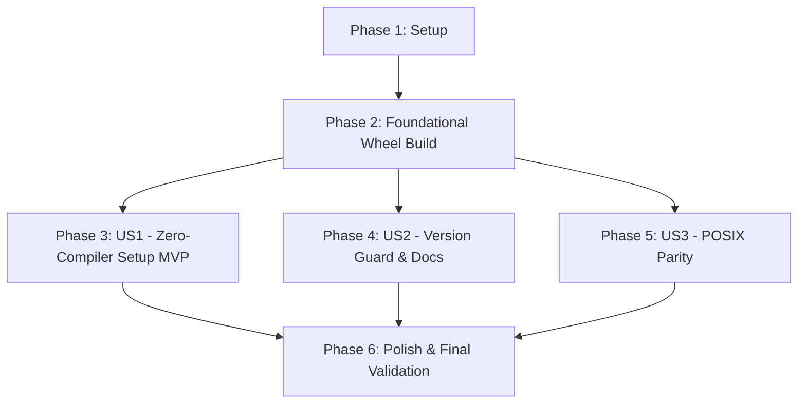

# Tasks: Zero-Compiler Windows Setup via Vendored Fairseq Wheel

**Feature**: [spec.md](./spec.md) | **Plan**: [plan.md](./plan.md) | **Directory**: `specs/022-vendor-fairseq-wheel`

---

## Phase 1: Setup (Shared Infrastructure)

**Purpose**: Verify workspace state, wheel directory structure, and git hygiene configurations.

- [X] T001 Verify and prepare wheels directory in python-backend/wheels/
- [X] T002 [P] Verify gitignore rules for wheels and build artifacts in .gitignore

---

## Phase 2: Foundational (Blocking Prerequisites)

**Purpose**: Build, package, and vendor the binary wheel (`fairseq==0.12.2`) for Python 3.10 Windows x64.

⚠️ **CRITICAL**: The pre-compiled wheel artifact MUST be ready before user story implementation and setup script modifications can be tested.

- [X] T003 Check fairseq installation in python-backend/venv and install rvc-python==0.1.5
- [X] T004 Identify exact installed fairseq version via pip show in python-backend/venv
- [X] T005 Build or cache-copy pre-compiled fairseq wheel into python-backend/wheels/
- [X] T006 Validate wheel filename and binary tags in python-backend/wheels/

**Checkpoint**: Pre-compiled binary wheel `fairseq-0.12.2-cp310-cp310-win_amd64.whl` exists and is validated in `python-backend/wheels/`.

---

## Phase 3: User Story 1 - Zero-Compiler Setup on Windows 64-bit (Priority: P1) 🎯 MVP

**Goal**: Enable seamless, zero-compiler setup on Windows 64-bit with Python 3.10 by installing the vendored wheel before general requirements.

**Independent Test**: Remove `python-backend/venv`, run `powershell -ExecutionPolicy Bypass -File scripts/setup.ps1`, verify no C++ compiler is invoked, and confirm `python-backend/server.py` runs with `rvc_python.infer` working.

### Implementation for User Story 1

- [X] T007 [US1] Update dependency configuration and vendoring comments in python-backend/requirements.txt
- [X] T008 [US1] Implement wheel detection and pre-installation step in scripts/setup.ps1
- [X] T009 [US1] Test end-to-end zero-compiler setup from fresh venv via scripts/setup.ps1
- [X] T010 [US1] Verify voice inference backend initialization and import in python-backend/server.py

**Checkpoint**: Windows 64-bit setup completes cleanly from a blank virtual environment without compiler tools.

---

## Phase 4: User Story 2 - Python Version Guard & Rebuild Guidance (Priority: P2)

**Goal**: Provide immediate, actionable diagnostic messages and instructions when users run an incompatible Python minor version.

**Independent Test**: Trigger setup logic with an alternate Python minor version, confirming the script warns the user clearly and links to `python-backend/wheels/README.md`.

### Implementation for User Story 2

- [X] T011 [P] [US2] Add diagnostic warning and Visual C++ guidance in scripts/setup.ps1
- [X] T012 [P] [US2] Create wheel rebuild documentation in python-backend/wheels/README.md

**Checkpoint**: Version mismatch scenarios gracefully output self-service troubleshooting instructions.

---

## Phase 5: User Story 3 - Preserved POSIX Environment Parity (Priority: P3)

**Goal**: Preserve native package installation behavior on Linux and macOS without Windows wheel interference.

**Independent Test**: Review `scripts/setup.sh` to ensure it executes standard dependency installation and documents why Windows wheels are bypassed.

### Implementation for User Story 3

- [X] T013 [US3] Maintain POSIX isolation and update comments in scripts/setup.sh

**Checkpoint**: Cross-platform POSIX setup scripts remain clean and decoupled from Windows binary wheels.

---

## Phase 6: Polish & Cross-Cutting Concerns

**Purpose**: Update global documentation, ensure git hygiene, and run final end-to-end validation.

- [X] T014 [P] Update installation documentation in README.md
- [X] T015 Perform repository hygiene and verify clean git status per .gitignore
- [X] T016 Run final validation against quickstart scenarios in specs/022-vendor-fairseq-wheel/quickstart.md

---

## Dependencies & Execution Order

### Phase Dependencies

- **Setup (Phase 1)**: Can start immediately.
- **Foundational (Phase 2)**: Depends on Phase 1; blocks User Stories because the wheel artifact is required for testing.
- **User Story 1 (Phase 3 - MVP)**: Depends on Foundational wheel availability.
- **User Story 2 (Phase 4)**: Can proceed alongside or immediately following US1.
- **User Story 3 (Phase 5)**: Independent POSIX review.
- **Polish (Phase 6)**: Executes after user stories to verify documentation, git hygiene, and end-to-end quickstart.

---

## Parallel Execution Opportunities

- **Phase 1**: `T002` (gitignore rules) can run in parallel with `T001` (wheels directory prep).
- **Phase 4**: `T011` (diagnostic warning in `setup.ps1`) and `T012` (rebuild guide in `wheels/README.md`) can be drafted in parallel.
- **Phase 6**: `T014` (README.md) can run in parallel with repository hygiene audits (`T015`).

---

## Implementation Strategy

### MVP First (Phases 1, 2, 3)

1. Verify wheels directory and git hygiene (Phase 1).
2. Build and verify `fairseq-0.12.2-cp310-cp310-win_amd64.whl` (Phase 2).
3. Update `setup.ps1` and `requirements.txt` to install local wheel (Phase 3).
4. **VALIDATE MVP**: Wipe venv, run `setup.ps1`, verify server starts and `rvc_python.infer` imports cleanly.

### Incremental Delivery (Phases 4, 5, 6)

5. Add diagnostic fallback for Python version mismatches and create `wheels/README.md` (Phase 4).
6. Verify POSIX script parity in `setup.sh` (Phase 5).
7. Update root `README.md`, clean git untracked files, and run final quickstart validation (Phase 6).
