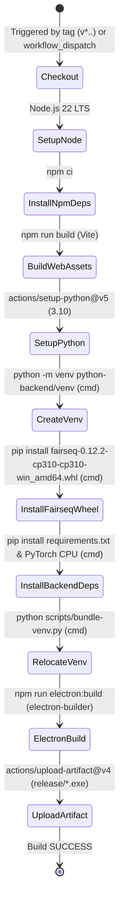
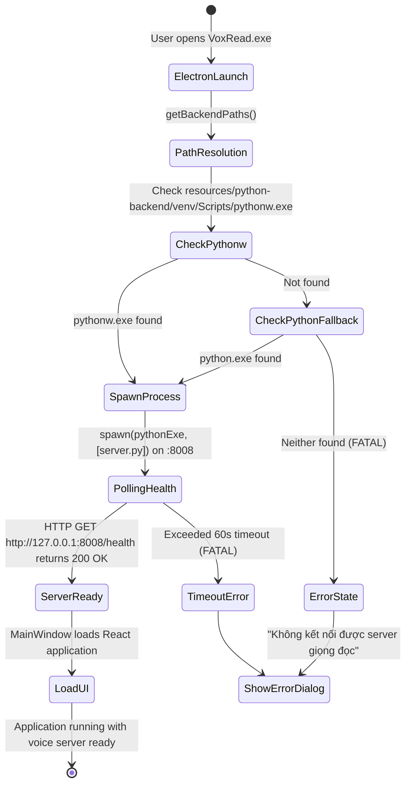

# Data Model & Configuration Schemas: Bundled Python Runtime & CI Packaging

**Feature**: `023-package-electron-venv`  
**Date**: 2026-09-05  
**Status**: Completed  

---

## 1. Entities & Configuration Schemas

### 1.1 `ExtraResourceEntry` (Electron Builder Resource Mapping)
Represents a resource directory or file mapping bundled by `electron-builder` into `<app_root>/resources/`.

```typescript
interface ExtraResourceEntry {
  /** Source path relative to project root */
  from: string;
  /** Destination path relative to process.resourcesPath */
  to: string;
  /** Optional file matching globs */
  filter?: string[];
}
```

**Attributes for this feature**:
```json
{
  "from": "python-backend/venv",
  "to": "python-backend/venv"
}
```

**Validation Rules**:
- `from` MUST resolve to an existing folder (`python-backend/venv`) at packaging time.
- `to` MUST mirror `from` so that `electron/main.ts` resolves `path.join(process.resourcesPath, 'python-backend', 'venv', 'Scripts', 'pythonw.exe')`.

---

### 1.2 `CIWorkflowStep` (GitHub Actions Workflow Step)
Represents a discrete execution step in `.github/workflows/build-electron.yml`.

```yaml
type: CIWorkflowStep
fields:
  name: string (Human-readable descriptive title)
  uses: optional string (Action identifier, e.g. actions/setup-python@v5)
  with: optional map (Action parameters, e.g. python-version: '3.10')
  run: optional string (Shell command sequence)
  shell: optional enum ['cmd', 'powershell', 'bash']
  env: optional map (Environment variables)
```

**Pipeline Steps Definition**:
1. `Set up Python 3.10`: `uses: actions/setup-python@v5`, `with: { python-version: '3.10' }`
2. `Create Python virtual environment`: `run: python -m venv python-backend/venv`, `shell: cmd`
3. `Install vendored fairseq wheel`: `run: python-backend\venv\Scripts\pip.exe install python-backend\wheels\fairseq-0.12.2-cp310-cp310-win_amd64.whl`, `shell: cmd`
4. `Install backend dependencies and PyTorch CPU`: `run: python-backend\venv\Scripts\pip.exe install -r python-backend\requirements.txt && python-backend\venv\Scripts\pip.exe install torch torchaudio --index-url https://download.pytorch.org/whl/cpu`, `shell: cmd`
5. `Make Python venv relocatable / standalone`: `run: python scripts/bundle-venv.py`, `shell: cmd`

---

### 1.3 `BundledPythonEnvironment` (Runtime Directory Layout)
Represents the physical filesystem structure expected by Electron at runtime:

```text
resources/python-backend/
├── server.py                                  # Flask & Edge-TTS/RVC server entrypoint
├── requirements.txt                           # Reference dependency manifest
└── venv/                                      # Standalone Python 3.10 runtime
    ├── DLLs/                                  # Compiled C extension DLLs (_ssl.pyd, etc.)
    ├── Lib/
    │   ├── os.py, json/, http/, urllib/, ...   # Python standard library
    │   └── site-packages/                     # Third-party wheels
    │       ├── torch/                         # PyTorch CPU neural network engine
    │       ├── torchaudio/                    # Audio tensor processing
    │       ├── fairseq/                       # Facebook AI sequence modeling toolkit
    │       ├── rvc_python/                    # Voice conversion pipeline
    │       ├── flask/                         # REST microservice
    │       └── edge_tts/                      # High-quality Vietnamese speech generator
    └── Scripts/
        ├── python.exe                         # Real standalone Python binary (103 KB)
        ├── pythonw.exe                        # Real windowless Python binary (101 KB)
        ├── python310.dll                      # Python 3.10 C runtime DLL (~4.4 MB)
        ├── python3.dll                        # Python 3 ABI bridge DLL (~66 KB)
        ├── vcruntime140.dll                   # Visual C++ 2015-2022 runtime DLL
        └── vcruntime140_1.dll                 # Visual C++ runtime extension DLL
```

---

### 1.4 `QuickstartSection` (README Dual-Track Documentation Model)
Represents the user-facing documentation structure in [README.md](file:///e:/reader/README.md):

```text
Quickstart
├── Track 1: Cách 1: Cài đặt đơn giản nhất (Dành cho người dùng)
│   ├── Target Audience: General end users, non-technical readers
│   ├── Download Source: GitHub Releases (.exe) or GitHub Actions Artifacts
│   ├── Prerequisites: NONE (No Python, No Node.js, No VC++ Build Tools)
│   ├── Disclosure: Installer file size is ~500MB–1.5GB due to bundled PyTorch AI engine
│   └── Launch Flow: Download -> Run Installer -> Open VoxRead -> Start Reading
└── Track 2: Cách 2: Dành cho nhà phát triển (Build từ mã nguồn)
    ├── Target Audience: Contributors, developers, model fine-tuners
    ├── Prerequisites: Node.js >= 18, Python 3.10 x64, Git
    ├── Setup Commands: scripts/setup.ps1 (Windows) or scripts/setup.sh (POSIX)
    ├── Development Run: npm run dev / npm run electron:dev
    └── Custom Build: npm run electron:build
```

---

## 2. State Machines & Lifecycle Transitions

### 2.1 CI Packaging Pipeline State Machine



---

### 2.2 Desktop Application Startup & Backend Spawn State Machine


