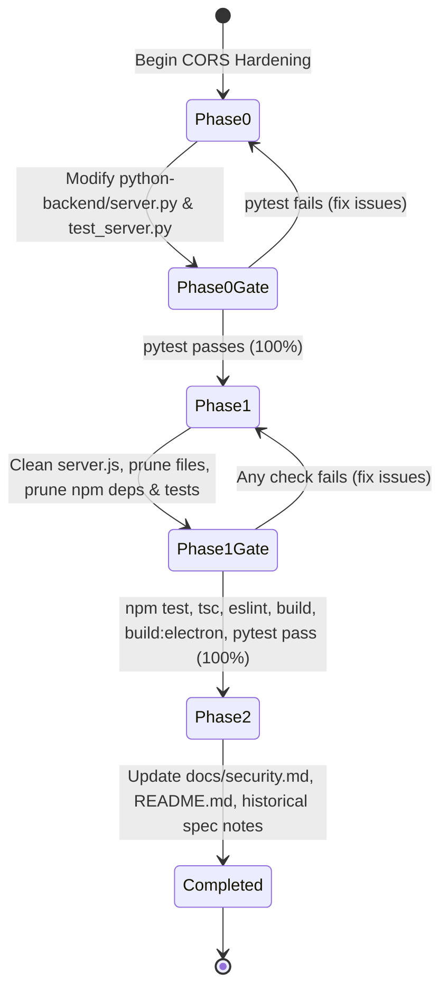

# Data Model & Endpoint Architecture: Cleaned Local Proxy & Hardened Python Server

**Feature**: `024-cleanup-saas-cors`  
**Date**: 2026-09-05  
**Status**: Completed  

---

## 1. Active Endpoint Architecture

### 1.1 Python Voice Synthesis Microservice (`python-backend/server.py`)
Binds to `http://127.0.0.1:8008`.

| Endpoint | Method | Input Payload | Output | Security Controls |
|---|:---:|---|---|---|
| `/health` | `GET` | None | `{ "ok": true, "model_loaded": bool }` | Origin whitelist CORS hook |
| `/speak` | `OPTIONS` | None | `204 No Content` | Origin whitelist CORS hook (POST, OPTIONS allowed) |
| `/speak` | `POST` | `{ "text": string (1..10000 chars) }` | `audio/wav` binary stream | Text length validation, RVC threading lock, Origin whitelist CORS hook |

**CORS Whitelist Rule**:
```python
ALLOWED_ORIGINS = {"http://localhost:3000", "http://127.0.0.1:3000", "null"}
# Also permits: origin.startswith("chrome-extension://")
```

---

### 1.2 Express Security Proxy (`server.js`)
Binds to `http://127.0.0.1:3001`.

| Endpoint | Method | Input Schema | Output | Active Defenses |
|---|:---:|---|---|---|
| `/health` | `GET` | None | `{ "status": "ok", "service": "...", ... }` | Helmet headers, CORS whitelist |
| `/api/generate` | `POST` | `generateSchema` | `{ "ok": true, "text": string, ... }` | `globalRateLimiter`, `aiRateLimiter`, Zod schema validation, Helmet, CORS whitelist |
| `/api/fetch-url` | `POST` | `fetchUrlSchema` | `{ "ok": true, "title": string, "content": string, ... }` | `globalRateLimiter`, Zod schema validation, SSRF guard (`assertPublicHost`), DOM sanitization, Helmet, CORS whitelist |
| `/api/ocr` | `POST` | `ocrSchema` | `{ "ok": true, "text": string }` | `globalRateLimiter`, `aiRateLimiter`, Zod schema validation, Magic bytes verification (`validateBase64Image`), Helmet, CORS whitelist |

---

## 2. Decommissioned Artifact Inventory

### 2.1 Removed Endpoints & Routers
- `/api/auth/register` (POST)
- `/api/auth/login` (POST)
- `/api/auth/logout` (POST)
- `/api/auth/me` (GET)
- `/api/documents` (GET, POST)
- `/api/documents/:id` (GET, PATCH, DELETE)
- `/api/admin/*`

### 2.2 Removed Files
```text
server/
├── routes/
│   ├── auth.js                  # DELETED
│   ├── documents.js             # DELETED
│   └── admin.js                 # DELETED
├── middleware/
│   ├── auth.js                  # DELETED
│   ├── botProtection.js         # DELETED
│   └── enforceHttps.js          # DELETED
├── lib/
│   ├── supabaseAdmin.js         # DELETED
│   ├── cookies.js               # DELETED
│   └── crypto.js                # DELETED
├── db/
│   └── index.js                 # DELETED
└── services/
    └── passwordService.js       # DELETED
supabase/                        # DELETED (all migrations)
src/
├── components/
│   ├── AuthGuard.tsx            # DELETED
│   └── AdminGuard.tsx           # DELETED
└── lib/
    └── supabaseClient.ts        # DELETED
```

---

## 3. Phase Gating & Transition Lifecycle


