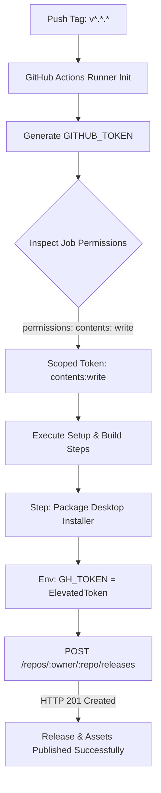

# Data Model & Schema: GitHub Actions Workflow Configuration

**Feature**: `025-electron-publish-permissions`  
**Date**: 2026-09-05  

---

## 1. Entities

### WorkflowConfiguration
Represents the root configuration structure of `.github/workflows/build-electron.yml`.
- `name` (string, required): "Build Desktop Application (Electron)"
- `on` (TriggerMapping, required): Defines trigger events
  - `workflow_dispatch` (empty object): Allows manual execution from GitHub Actions UI
  - `push.tags` (list of string): `['v*.*.*']` (triggers on version tag push)
- `jobs` (map of JobSpecification, required): Job definitions

### JobSpecification (`build-windows`)
Represents the Windows desktop compilation and installer packaging job.
- `name` (string): "Build Windows Installer (.exe)"
- `runs-on` (string): `windows-latest`
- `permissions` (PermissionMapping, required): Access token permissions for `GITHUB_TOKEN`
  - `contents` (enum: `read` | `write` | `none`): Set to `write`
- `steps` (list of StepSpecification, required): Sequence of execution steps

### StepSpecification (`Package Desktop Installer`)
The step that invokes `electron-builder`.
- `name` (string): "Package Desktop Installer (Electron Builder)"
- `run` (string): `npm run electron:build`
- `env` (map of string):
  - `GH_TOKEN`: `${{ secrets.GITHUB_TOKEN }}`

---

## 2. State & Access Control Flow

