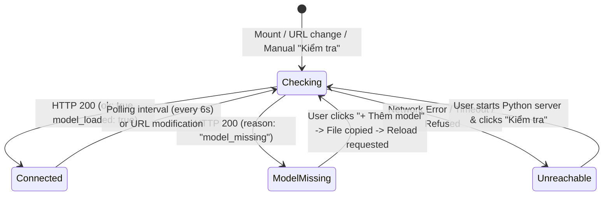

# Data Model: RVC Voice Model Management & One-Click Import

**Feature Branch**: `027-rvc-model-management`  
**Date**: 2026-09-05  
**Spec**: [spec.md](./spec.md)

---

## 1. Domain Entities & State Types

### VoiceServerConnectionStatus
Represents the connection and readiness state of the local RVC TTS server as observed by the frontend:

```typescript
export type VoiceServerConnectionStatus = 
  | 'checking'       // Active health probe in flight
  | 'connected'      // Server reachable AND voice model loaded (.pth ready)
  | 'model_missing'  // Server reachable BUT no .pth model weights found in model/
  | 'unreachable';   // Server process not running, timeout, or network error
```

### HealthResponse (Backend `/health` Payload)
Structured diagnostic output returned by `GET /health`:

```typescript
export interface HealthResponse {
  ok: boolean;               // true if model is loaded and server is ready
  model_loaded: boolean;     // true if RVC inference engine has initialized a .pth model
  reason?: string;           // "model_missing" when ok is false due to absence of model files
  model_dir?: string;        // Absolute path to the python-backend/model directory
  model_name?: string;       // Basename of the active .pth file (e.g. "Chess_25e_12750s.pth")
  index_name?: string;       // Basename of the active .index file (e.g. "Chess.index")
}
```

### ModelListResponse (Backend `GET /model/list` Payload)
Detailed directory listing returned by the model inspection endpoint:

```typescript
export interface ModelListResponse {
  ok: boolean;
  model_dir: string;         // Absolute path to model directory
  active_model: string | null; // Primary .pth loaded by server
  active_index: string | null; // Primary .index loaded by server
  pth_files: string[];       // Array of discovered .pth filenames
  index_files: string[];     // Array of discovered .index filenames
}
```

### ModelImportResult (Electron IPC Channel Result)
Result returned from the native file import dialog operation:

```typescript
export interface ModelImportResult {
  success: boolean;          // true if at least one file was imported successfully
  canceled?: boolean;        // true if user closed dialog without selection
  importedFiles?: string[];  // Array of copied file basenames (e.g. ["my_voice.pth", "my_voice.index"])
  targetDir?: string;        // Destination path (python-backend/model/)
  error?: string;            // Error description if copying failed
}
```

### DesktopModelsBridge (Preload API Contract)
Interface exposed to the renderer process via `window.voxreadDesktop.models`:

```typescript
export interface DesktopModelsBridge {
  getDir: () => Promise<string>;
  openFolder: () => Promise<{ success: boolean; error?: string }>;
  importModel: () => Promise<ModelImportResult>;
}
```

---

## 2. State Transition Lifecycle



---

## 3. Storage & Filesystem Layout

```text
python-backend/
├── model/                      # Auto-created on startup if absent
│   ├── .gitkeep                # Preserves empty folder in repository
│   ├── <model_name>.pth        # RVC generator weights (~50MB - 150MB)
│   └── <model_name>.index      # Optional Faiss feature index (~30MB - 80MB)
└── server.py                   # Flask server managing RVCInference lifecycle
```

### Directory Validation Rules
1. `model/` is always relative to `server.py` (`os.path.join(os.path.dirname(os.path.abspath(__file__)), "model")`).
2. Discovered `.pth` files must end in `.pth` and not begin with `.` (hidden files ignored).
3. Discovered `.index` files must end in `.index` and not begin with `.`.
4. The active model defaults to the first sorted alphabetical `.pth` file, and active index defaults to the first sorted `.index` file.
