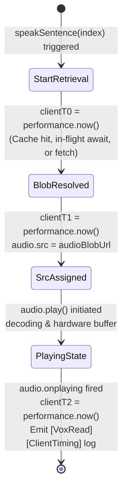

# Data Model: TTS Latency Diagnostics

**Feature**: `040-tts-latency-diagnostics`  
**Date**: 2026-09-06

## Entities & Data Structures

### 1. ProcessSpawnOptions (Electron Main Process)

Defines the configuration passed to `child_process.spawn()` when launching `server.py`:

```typescript
interface PythonSpawnOptions {
  cwd: string;
  detached: boolean;
  stdio: ['ignore', number, number]; // [stdin, stdout(logFd), stderr(logFd)]
  env: NodeJS.ProcessEnv & {
    PYTHONUNBUFFERED: '1';
  };
}
```

- **`PYTHONUNBUFFERED`**: `'1'` ensures Python does not buffer output to stdout/stderr.
- **`stdio`**: File descriptor (`logFd`) opened synchronously via `fs.openSync(logPath, 'w')`.

---

### 2. ClientTimingMetrics (Frontend Telemetry)

Represents the performance measurements taken in `src/hooks/useTTS.ts` during an RVC sentence playback sequence:

```typescript
interface ClientTimingMetrics {
  clientT0: number; // DOMHighResTimeStamp from performance.now() before cache/fetch
  clientT1: number; // DOMHighResTimeStamp after audioBlobUrl is resolved
  clientT2: number; // DOMHighResTimeStamp inside audio.onplaying
  fetchCacheDurationMs: number; // (clientT1 - clientT0)
  playbackStartupDurationMs: number; // (clientT2 - clientT1)
}
```

#### Lifecycle & Transitions



---

### 3. Diagnostic Log Event Structures

#### A. Backend Server Log (`python-backend/server.log`)
- Format:
  ```text
  [VoxRead][Timing] Edge-TTS: {edge_duration:.2f}s | RVC inference: {rvc_duration:.2f}s
  ```
- Triggered by: Completion of `/speak` route in `server.py`.
- Delivery: Unbuffered flush directly to file descriptor `logFd`.

#### B. Frontend Console Log (Browser / DevTools Console)
- Format:
  ```text
  [VoxRead][ClientTiming] Cho fetch/cache: {fetchCacheDuration}ms | Cho audio bat dau phat sau khi gan src: {playbackStartupDuration}ms
  ```
- Triggered by: `audio.onplaying` event listener in `src/hooks/useTTS.ts`.
- Delivery: Direct to DevTools console.
