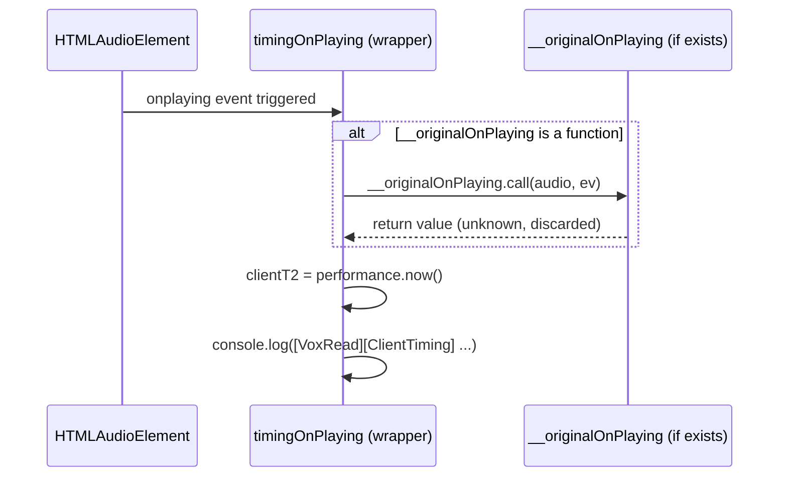

# Data Model: Fix ESLint Any in useTTS ClientTiming

**Feature**: `041-fix-tts-eslint-any`  
**Date**: 2026-09-06

## Entities & Data Structures

### 1. `audioWithCustomProps` Type Definition

Local type cast applied to `audio` (`HTMLAudioElement`) in `src/hooks/useTTS.ts` (`speakSentence`):

```typescript
const audioWithCustomProps = audio as unknown as {
  __originalOnPlaying?: ((this: GlobalEventHandlers, ev: Event) => unknown) | null;
};
```

#### Fields:
- **`__originalOnPlaying`** *(optional)*:
  - **Type**: `((this: GlobalEventHandlers, ev: Event) => unknown) | null`
  - **Description**: Holds a reference to any preexisting `onplaying` event listener that was attached to the audio element before the client timing telemetry wrapper (`timingOnPlaying`) was installed.
  - **Return Type**: `unknown` (safe top-type indicating the return value is discarded and not inspected).

---

### 2. Event Invocation & Lifecycle


