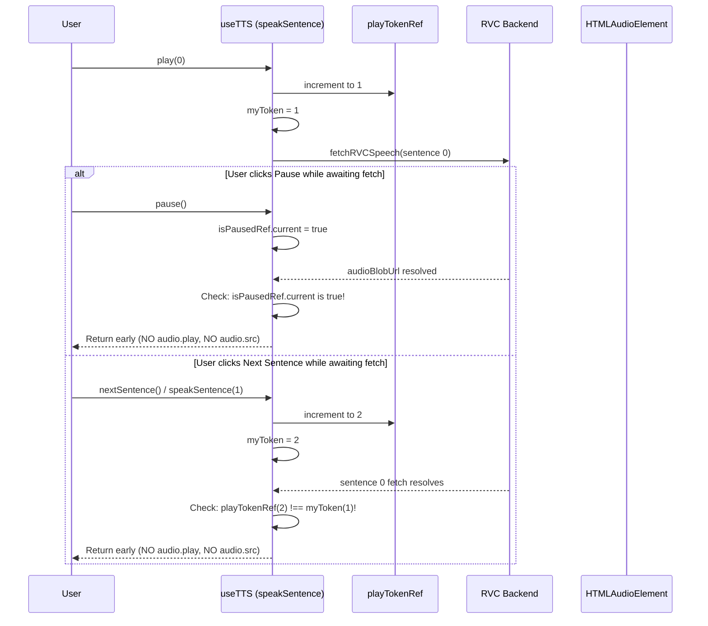

# Data Model: TTS Generation Token & Race Condition Stale Check

**Feature**: `042-tts-race-condition-token`  
**Date**: 2026-09-06

## Entities & State Structures

### 1. `PlayTokenTracker`
State ref allocated within `useTTS` hook instance:

```typescript
const playTokenRef = useRef<number>(0);
```

- **Type**: `React.MutableRefObject<number>`
- **Scope**: Lifecycle of the `useTTS` hook instance.
- **Initial Value**: `0`.
- **Transitions**:
  - Incremented by `+1` on every call to `speakSentence(index)`.
  - Incremented by `+1` on every call to `stop()`.

---

### 2. `GenerationTicket` (`myToken`)
Immutable local identifier in each asynchronous `speakSentence` call frame:

```typescript
const myToken = playTokenRef.current;
```

- **Type**: `number`
- **Scope**: Local to the `speakSentence` execution frame.
- **Validity Invariant**:
  A frame is valid to mutate audio output IF AND ONLY IF:
  $$\text{playTokenRef.current} = \text{myToken}$$

---

### 3. Playback State Synchronization Matrix

| Condition | `playTokenRef === myToken` | `isPlayingRef` | `isPausedRef` | `currentIdxRef === index` | Action Allowed? |
| :--- | :---: | :---: | :---: | :---: | :---: |
| **Normal Playback** | ✅ True | ✅ True | ❌ False | ✅ True | **Proceed** to set src & play |
| **User Paused Mid-fetch** | ✅ True | ✅ True | ⚠️ True | ✅ True | **Abort** (do not play, do not assign src) |
| **User Skipped Sentence** | ❌ False | ✅ True | ❌ False | ❌ False | **Abort** (stale token & mismatched index) |
| **User Stopped Playback** | ❌ False | ❌ False | ❌ False | N/A | **Abort** (stale token & not playing) |
| **Rapid Double Jump** | ❌ False | ✅ True | ❌ False | ❌ False | **Abort** (ticket invalidated) |

---

### 4. Lifecycle Flow Diagram


