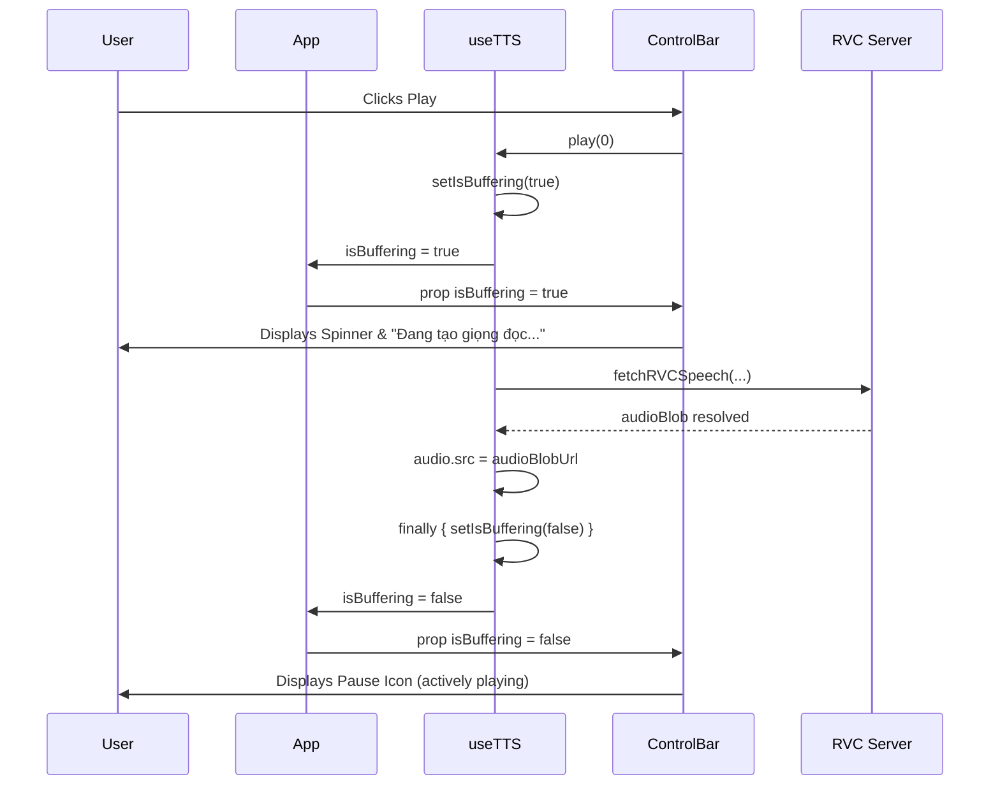

# Data Model: TTS Generation Buffering Visual Indicator

**Feature**: `044-tts-buffering-indicator`  
**Date**: 2026-09-06

## State Entities & Prop Threading

### 1. `useTTS` Return Interface Extension

```typescript
interface UseTTSReturn {
  ...
  isBuffering: boolean; // True when awaiting audio synthesis in RVC mode
}
```

- **Initial Value**: `false`.
- **Active Window**: From start of `audioBlobUrl` retrieval until `audio.src` is assigned or early return.

---

### 2. Component Props Interface Extension

```typescript
// src/components/ControlBar.tsx
interface ControlBarProps {
  isPlaying: boolean;
  isPaused: boolean;
  isBuffering?: boolean;
  ...
}
```

---

### 3. State & Visual Mapping Matrix

| `isPlaying` | `isPaused` | `isBuffering` | Displayed Icon | Button Title / Aria-Label |
| :---: | :---: | :---: | :---: | :--- |
| Any | Any | **True** | `<Loader2 className="animate-spin ..." />` | "Đang tạo giọng đọc..." |
| **True** | **False** | False | `<Pause ... />` | "Tạm dừng (Phím Space)" / "Tạm dừng" |
| **False** or Any | **True** | False | `<Play ... />` | "Phát tiếp (Phím Space)" / "Phát tiếp" |

---

### 4. Lifecycle Sequence


